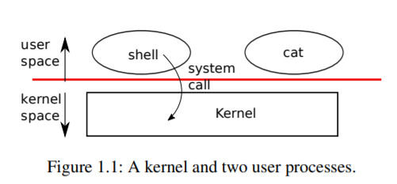

## 第一章--操作系统界面。

操作系统的任务是在多个程序之间共享一台计算机，并提供一组比硬件单独支持的更有用的服务。操作系统管理和抽象化低级硬件，从而例如，单词 ‘process’ 或不需要关心正在使用哪种类型的盘硬件。它还在多个程序之间共享硬件，以便它们同时运行 (或看起来像在运行)。最后，操作系统为程序提供了可控的交互方式，以便它们可以共享数据或协同工作。

操作系统通过接口向用户程序提供服务。事实证明，设计一个好的界面是很困难的。一方面，我们希望接口简单而狭窄，因为这样更容易获得正确的实现。另一方面，我们可能会想为应用程序提供许多复杂的功能。解决这种紧张关系的诀窍是设计依赖于一些机制的界面，这些机制可以组合起来提供更多的通用性。

本书使用单个操作系统作为具体示例来说明操作系统的概念。该操作系统xv6提供了肯·汤普森(Ken Thompson) 和丹尼斯·里奇(Dennis Ritchie) 的Unix操作系统引入的基本接口[10]，并模仿了Unix的内部设计。UNIX提供了一个狭窄的接口，其机制很好地结合在一起，提供了令人惊讶的通用性。这种接口非常成功，以至于现代操作系统-BSD、Linux、MacOSX、Solaris，甚至在较小程度上还有 Microsoft Windows- 都有类似 Unix 的接口。理解 xv6 是理解这些系统和许多其他系统的良好开端。

如图1.1 所示，xv6采用传统的“内核” 形式，即为正在运行的程序提供服务的特殊程序。每个运行的程序，称为“进程”，都有包含指令、数据和堆栈的内存。指令实现程序的计算。数据是计算所依据的变量。堆栈组织程序的过程调用。

当进程需要调用内核服务时，它会调用操作系统接口中的过程调用。这样的过程称为“系统调用”。系统调用进入内核；内核执行服务并返回。因此，进程在 “用户空间”和“内核空间” 中交替执行。

内核使用CPU的硬件保护机制，来确保在用户空间中执行的每个进程只能访问自己的内存。内核使用实现这些保护所需的硬件权限执行；用户程序在没有这些权限的情况下执行。当用户程序调用系统调用时，硬件提高特权级别并开始执行内核中预先安排的函数。



内核提供的系统调用集合是用户程序看到的接口。xv6内核提供Unix内核传统上提供的服务和系统调用的子集。图1.2列出了xv6的所有系统调用。

本章的其余部分概述了xv6的服务-进程、内存、文件描述符、管道和文件系统-并用代码片段和关于 “外壳” (shell) (传统类Unix系统的主要用户界面)如何使用它们的讨论来说明这些服务。shell对系统调用的使用说明了它们是如何精心设计的。

外壳 shell 是从用户读取命令并执行它们的普通程序。shell 是一个用户程序，而不是内核的一部分，这一事实说明了系统调用接口的强大功能：shell没有什么特别之处。这也意味着shell很容易替换；因此，现代 Unix系统有多种 shell 可供选择，每个shell都有自己的用户界面和脚本功能。xv6 shell是Unix Bourne shell本质的简单实现。其实现可以在(user/sh.c：1)中找到。


### 1.1 进程和内存。

xv6进程由用户空间内存(指令、数据和堆栈)和内核专用的每个进程状态组成。Xv6可以“分时共享” (Time Sharing) 进程：它透明地在一组等待执行的进程之间切换可用的CPU。当进程不执行时，xv6保存其CPU寄存器，在下次运行该进程时恢复它们。内核将进程标识符或`pid`与每个进程相关联。

进程可以使用`fork`系统调用创建一个新进程，`fork`创建一个称为`子进程`的新进程，其内存内容与调用进程完全相同，称为`父进程`。`Fork`同时返回父级和子级。在父进程中，`fork`返回子进程的PID；在子进程中，它返回零。例如，考虑用C编程语言编写的以下程序片段[5]：

System call          | Description
---------------------|-----------------------------
fork()               | Create a process
exit(xstatus)        | Terminate the current process with xstatus indicating success of failure
wait(*xstatus)       | Wait for a child process to exit and copy the child’s exit status to xstatus
kill(pid)            | Terminate process pid
getpid()             | Return the current process’s pid
sleep(n)             | Sleep for n clock ticks
exec(filename, *argv)| Load a file and execute it
sbrk(n)              | Grow process’s memory by n bytes
open(filename, flags)| Open a file; the flags indicate read/write
read(fd, buf, n)     | Read n bytes from an open file into buf
write(fd, buf, n)    | Write n bytes to an open file
close(fd)            | Release open file fd
dup(fd)              | Duplicate fd
pipe(p)              | Create a pipe and return fd’s in p
chdir(dirname)       | Change the current directory
mkdir(dirname)       | Create a new directory
mknod(name, major, minor) | Create a device file
fstat(fd)            | Return info about an open file
link(f1, f2)         | Create another name (f2) for the file f
unlink(filename)     | Remove a file

> Figure 1.2: Xv6 system calls

Exit 系统调用会导致调用进程停止执行，并释放内存和打开文件等资源。Exit采用整数状态参数，通常0表示成功，1表示失败。`wait`系统调用返回当前进程的退出子级的PID，并将该子进程的退出状态复制到传递给等待的地址；如果调用方的子级都没有退出，则`wait`等待一个子级退出。如果家长不关心孩子的退出状态，可以将0地址传给`wait`。

在本例中，输出行

```
parent: child=1234
child: exiting
```

可能以任一顺序出现，这取决于父级还是子级先到达其`printf` 调用。子进程退出父进程后，返回父进程的“wait`”，导致父进程打印

```
parent: child 1234 is done
```

尽管子进程最初具有与父进程相同的内存内容，但父进程和子进程使用不同的内存和不同的寄存器执行：更改其中一个变量不会影响另一个变量。例如，当`wait`的返回值存储到`父进程`的`pid`中时，不会更改子进程中的变量`pid`。子对象中的`pid`值仍为零。

exec系统调用使用从文件系统中存储的文件加载的新内存映像替换调用进程的内存。文件必须具有特定的格式，该格式指定文件的哪一部分包含指令、哪一部分是数据、从哪条指令开始等。xv6使用ELF格式，第3章对此进行了更详细的讨论。当`exec`成功时，它不会返回到调用程序；相反，从文件加载的指令在ELF标头中声明的入口点开始执行。`exec`有两个参数：包含可执行文件的文件名和字符串参数数组。例如：


```c
char *argv[3];

argv[0] = "echo";
argv[1] = "hello";
argv[2] = 0;
exec("/bin/echo", argv);
printf("exec error\en");
```

此片段将调用程序替换为使用参数串 echo hello 运行的程序 /bin/echo的实例。大多数程序忽略第一个参数，它通常是程序的名称。

xv6 shell使用上述调用代表用户运行程序。shell的主要结构很简单；请参见main(user/sh.c：145)。主循环使用`getcmd`从用户读取一行输入。然后它调用`fork`，这将创建shell进程的副本。父级调用`wait`，子级运行命令。例如，如果用户在shell中键入“echo hello”，则将使用“echo hello”作为参数调用runcmd。runcmd(user/sh.c：58)运行实际的命令。对于“echo hello”，它会调用`exec`(user/sh.c：78)。如果`exec`成功，则子级将执行来自echo而不是runcmd的指令。在某个point techowill调用exit，这将导致父进程从`main`(user/sh.c：145)中的`wait`返回。

您可能想知道为什么没有将`fork`和`exec`组合在一个调用中；稍后我们将看到，创建进程和加载程序的单独调用在shell中有一些用于I/O重定向的巧妙用法。为了避免创建重复进程然后立即替换的浪费，操作内核使用写时复制等虚拟内存技术优化了此用例的`fork`实现。

Xv6隐式分配大部分用户空间内存：`fork`分配父内存的子级副本所需的内存，`exec`分配足够的内存来保存可执行文件。在运行时需要更多内存的进程(可能是`malloc`)可以调用 `sbrk(n)` 以按字节增加其数据内存；`sbrk`返回新内存的位置。

Xv6不提供用户的概念或保护一个用户免受另一个用户的伤害；在Unix术语中，所有xv6进程都是以 "根 (root) 用户" 身份运行的。

### 1.2 I/O和文件描述符。

“文件描述符”是一个小整数，表示进程可以读取或写入的内核管理对象。进程可以通过打开文件、目录或设备，或通过创建管道，或通过复制现有描述符来获得文件描述符。为简单起见，我们通常将文件描述符称为“文件”的对象称为“文件”；文件描述符接口抽象了文件、管道和设备之间的差异，使它们看起来都像字节流。

在内部，xv6内核使用文件描述符作为每个进程表的索引，因此每个进程都有一个从零开始的私有文件描述符空间。按照惯例，进程从文件描述符0(标准输入)读取，将输出写入文件描述符1(标准输出)，并将错误消息写入文件描述符2(标准错误)。正如我们将看到的，shell利用该约定来实现I/O重定向和管道。shell确保它始终打开三个文件描述符(user/sh.c：151)，这三个文件描述符在默认情况下是控制台的文件描述符。

`read`和`write`系统调用从文件描述符命名的打开文件的读取字节和写入字节。调用`read(fd，buf，n)` 从`文件描述符`fd中读取最多n个字节，复制到`buf`中，返回读取的字节数。引用文件的每个文件描述符都有一个与之相关联的偏移量。`read`从当前文件偏移量中读取数据，然后将该偏移量向前推进读取的字节数：随后的`read`将返回第一个`read`返回的字节之后的字节。当没有更多字节可读时，`read`返回0表示文件结束。

调用`write(fd，buf，n)`将来自`buf`的n字节写入`文件描述符`fd，并返回写入的字节数。仅在发生错误时写入的字节数少于。与`read`一样，`write`在当前文件偏移量处写入数据，然后将该偏移量向前推进写入的字节数：每个`write`从前一个文件停止的位置开始。

下面的程序片段(构成程序cat的本质)将数据从其标准输入复制到其标准输出。如果发生错误，它会向标准错误写入一条消息。


```c
char buf[512];
int n;

for(;;) {
  n = read(0, buf, sizeof buf);
  if(n == 0)
    break;
  if(n < 0){
    fprintf(2, "read error\en");
    exit();
  }
  if(write(1, buf, n) != n){
    fprintf(2, "write error\en");
    exit();
  }
}
```

在代码片段中需要注意的重要一点是，cat不知道它是从文件、控制台还是管道读取。同样，cat也不知道它是打印到控制台、文件还是其他任何文件。文件描述符的使用以及输入文件描述符0和输出文件描述符1的约定允许CAT的简单实现。

`Close`系统调用释放文件描述符，使其可供将来的`open`、管道或`dup`系统调用重用(见下文)。新分配的文件描述符始终是当前进程中编号最小的未使用描述符。

文件描述符和`fork`交互，使得I/O重定向易于实现。`Fork`复制父级的文件描述符表及其内存，以便子级从与父级完全相同的打开文件开始。系统调用`exec`替换调用进程的内存，但保留其文件表。此行为允许shell通过派生、重新打开选定的文件描述符，然后执行新程序来实现I/O重定向。以下是shell为`Cat < input.txt`命令运行的代码的简化版本：


```c
char *argv[2];

argv[0] = "cat";
argv[1] = 0;
if(fork() == 0) {
  close(0);
  open("input.txt", O_RDONLY);
  exec("cat", argv);
}
```

在子级关闭文件描述符0之后，保证`open`对新打开的`input.txt：0`使用该文件描述符，它将是可用的最小文件描述符。然后，Cat 使用引用input.txt 的文件描述符0(标准输入)执行。

xv6 shell中的I/O重定向代码正是以这种方式工作的(user/sh.c：82)。回想一下，在代码中的这一点上，shell已经派生了子shell，runcmd将调用exec来加载新程序。现在应该很清楚为什么将fork和exec作为单独的调用是一个好主意。因为如果它们是分开的，shell可以派生一个子级，在子级中使用`open，close，dup`来更改标准的输入和输出文件描述符，然后使用`exec`。不需要更改正在执行的程序(在我们的示例中)。如果fork和exec组合到单个系统调用中，shell将需要其他一些(可能更复杂的)方案来重定向标准输入和输出，否则程序本身将必须了解如何重定向I/O。

尽管fork复制文件描述符表，但每个底层文件偏移量都在父级和子级之间共享。请考虑以下示例：

```c
if(fork() == 0) {
  write(1, "hello ", 6);
  exit(0);
} else {
  wait(0);
  write(1, "world\en", 6);
}
```

在此片段的末尾，附加到文件描述符1的文件将包含数据hello world。父级中的`write`(多亏了`wait`，它只在子级完成后才运行)继续从子进程的`write`中断的位置开始。此行为有助于从shell命令序列生成顺序输出，如`(echo hello；echo world) > output.txt`。

dup 系统调用复制现有的文件描述符，返回引用相同底层I/O对象的新描述符。这两个文件描述符共享一个偏移量，就像fork复制的文件描述符一样。这是将hello world写入文件的另一种方式：

```c
fd = dup(1);
write(1, "hello ", 6);
write(fd, "world\en", 6);
```

如果两个文件描述符是通过一系列`fork`和`dup`调用从同一原始文件描述符导出的，则它们共享一个偏移量。否则，文件描述符不共享偏移量，即使它们是由对同一文件的`open`调用产生的。`dup`允许shell实现这样的命令：`ls Existing-file NONISTING-FILE>tmp1 2>&1`。其中 `2>&1`告诉shell给命令一个与描述符1重复的文件描述符2。现有文件的名称和不存在的文件的错误消息都会出现在filetmp1中。xv6 shell不支持错误文件描述符的I/O重定向，但是现在您知道了如何实现它。

文件描述符是一种强大的抽象，因为它们隐藏了它们所连接的细节：写入文件描述符1的进程可能正在写入文件、写入控制台之类的设备或写入管道。

### 1.3管道。

‘pipe`是一个小的内核缓冲区，作为一对文件描述符向进程公开，一个用于读取，一个用于写入。将数据写入管道的一端使该数据可用于从管道的另一端读取。管道为进程提供了一种通信方式。

下面的示例代码使用连接到管道的读取端的标准输入运行程序。


```c
int p[2];
char *argv[2];

argv[0] = "wc";
argv[1] = 0;

pipe(p);
if(fork() == 0) {
  close(0);
  dup(p[0]);
  close(p[0]);
  close(p[1]);
  exec("/bin/wc", argv);
} else {
  close(p[0]);
  write(p[1], "hello world\en", 12);
  close(p[1]);
}
```

程序调用`pipe`，它创建一个新管道，并将读写文件描述符记录在陣列 p中。在`fork`之后，父和子都有引用管道的文件描述符。子级将读取端复制到文件描述符0上，关闭文件描述符 p 和執行 `wc`。当 `wc`从其标准输入读取时，它从管道读取。父级关闭管道的读取端，写入管道，然后关闭写入端。

如果没有数据可用，管道上的`read`将等待写入数据或关闭所有指向写入端的文件描述符；在后一种情况下，`read`将返回0，就像已经到达数据文件的末尾一样。“read”阻塞，直到新数据不可能到达，这是孩子在执行wc 結束之前关闭管道写入端很重要的一个原因：如果wc的某个文件描述符指的是管道的写入端，wc将永远看不到文件结束端。

xv6 shell以类似于上述代码(user/sh.c：100)的方式实现`grep fork sh.c | wc-l` 等管道。子进程创建管道以连接管道的左端和右端。然后，对于管道的左端调用`fork`和`runcmd`，对于右端调用`fork`和`runcmd`，并等待两者都完成。流水线的右端可以是本身包括管道(例如，a|b|c)的命令，该管道本身派生两个新的子进程(一个用于b 一个用于c)。因此，外壳可以创建进程树。此树的叶子是命令，内部节点是等待左子节点和右子节点完成的进程。原则上，您可以让内部节点运行管道的左端，但正确这样做会使实现变得复杂。

管道似乎并不比临时文件更强大：管道

    echo hello world | wc

可以在没有管道的情况下实现，如

    echo hello world >/tmp/xyz; wc </tmp/xyz

在这种情况下，与临时文件相比，管道至少有四个优点。首先，管道会自动清除；使用文件重定向时，shell必须小心删除/tmp/xyz。其次，管道可以传递任意长的数据流，而文件重定向需要磁盘上有足够的可用空间来存储所有数据。第三，管道允许并行执行管道阶段，而文件方法要求第一个程序在第二个程序开始之前完成。第四，如果要实现进程间通信，管道的阻塞读写比文件的非阻塞语义更有效。

### 1.4文件系统。

xv6文件系统提供数据文件和目录，数据文件是未解释的字节数组，目录包含对数据文件和其他目录的命名引用。这些目录形成一棵树，从名为“root”的特殊目录开始。类似 `/a/b/c` 的 `path` 指向根目录/中名为 a 的目录中名为 b 的目录下名为 c inedcinb的文件或目录。不以/开头的路径相对于调用进程的`当前目录‘进行求值，该目录可以通过 chdir 系统调用进行更改。这两个代码片段打开相同的文件(假设所有涉及的目录都存在)：

```c
chdir("/a");
chdir("b");
open("c", O_RDONLY);

open("/a/b/c", O_RDONLY);
```

第一个片段将进程的当前目录更改为 `/a/b`；第二个片段既不引用也不更改进程的当前目录。

创建新文件或目录有多个系统调用：`mkdir`创建新目录，带`O_CREATE`标志的 `open` 创建新数据文件，mknod 创建新设备文件。此示例说明了所有这三种情况：

```c
mkdir("/dir");
fd = open("/dir/file", O_CREATE|O_WRONLY);
close(fd);
mknod("/console", 1, 1);
```

`Mknod`在文件系统中创建一个文件，但该文件没有内容。相反，文件的元数据将其标记为设备文件，并记录主设备编号和次要设备编号(`mknod` 的两个参数)，它们唯一地标识内核设备。当一个进程稍后打开该文件时，内核会将`read`和`write`系统调用转移到内核设备实现，而不是将它们传递到文件系统。

`fstat` 检索有关文件描述符引用的对象的信息。它填充 `stat.h`(kernel/stat.h)中定义的 `struct stat`：


```c
#define T_DIR 1 // Directory
#define T_FILE 2 // File
#define T_DEVICE 3 // Device

struct stat {
  int dev; // File system’s disk device
  uint ino; // Inode number
  short type; // Type of file
  short nlink; // Number of links to file
  uint64 size; // Size of file in bytes
};
```

文件的名称与文件本身不同；同一底层文件(称为 inode)可以有多个名称(称为 `links`)。`links`系统调用创建引用与现有文件相同的索引节点的另一个文件系统名称。此片段创建名为a和b的新文件。

```c
open("a", O_CREATE|O_WRONLY);
link("a", "b");
```

读或写与读或写是一样的。每个inode由唯一的inode编号标识。在上面的代码序列之后，可以通过检查`stat`的结果来确定 a 和 b 引用相同的底层内容：两者都将返回相同的inode编号 (ino)，并且将 `nlink` 设置为2。

`unlink`系统调用从文件系统中删除一个名称。只有当文件的链接计数为零且没有文件描述符引用它时，才会释放文件的inode和保存其内容的磁盘空间。因此添加了

```c
unlink("a");
```

最后一个代码序列将索引节点和文件内容保留为b可访问。此外，

```c
fd = open("/tmp/xyz", O_CREATE|O_RDWR);
unlink("/tmp/xyz");
```

是创建临时inode的惯用方式，当进程关闭fd或退出时将清除该临时inode。

用于文件系统操作的shell命令被实现为用户级程序，如 `mkdir、ln、rm`等。此设计允许任何人只需添加一个新的用户级程序，即可使用新的用户命令扩展shell。事后看来，这个计划似乎是显而易见的，但在Unix时代设计的其他系统通常会将这样的命令构建到shell中(并将shell构建到内核中)。

内置于shell(user/sh.c：160) 的 `cd` 是一个例外. `cd` 它必须更改shell本身的当前工作目录。如果cd作为常规命令运行，那么shell将派生一个子进程，子进程将运行，cd将更改文件的工作目录。父目录(即外壳的)工作目录不会更改。

### 1.5真实世界。

UNIX结合了“标准”文件描述符、管道和方便的shell语法来对它们进行操作，这是编写通用可重用程序方面的重大进步。这个想法引发了一种“软件工具”的整体文化，这是Unix强大和受欢迎的主要原因，而shell是第一种所谓的“脚本语言”。Unix系统调用接口将持续存在像BSD、Linux和MacOSX这样的系统中。

Unix系统调用接口已经通过可移植操作系统接口(POSIX)标准进行了标准化。Xv6与POSIX不兼容。它错过了系统调用(包括基本的系统调用，如 `lseek`)，它只实现了部分系统调用，以及其他差异。我们xv6的主要目标是简单明了，同时提供一个简单的类似UNIX的系统调用接口。为了运行基本的Unix程序，有几个人扩展了xv6，增加了几个系统调用和一个简单的C库。然而，与xv6相比，现代内核提供了更多的系统调用和更多种类的内核服务。例如，它们支持联网、窗口系统、用户级线程、许多设备的驱动程序等等。现代内核不断快速发展，并提供了许多超越POSIX的特性。

在很大程度上，现代Unix派生的操作系统没有遵循早期的Unix模型，即将设备公开为特殊文件，如上面讨论的控制台设备文件。Unix的作者继续构建了Plan 9，该计划将“资源即文件”的概念应用于现代设施，将网络、图形和其他资源表示为文件或文件树。文件系统和文件描述符已经成为强大的抽象。即便如此，还有其他型号的操作系统接口。Unix的前身Multics对文件存储进行了抽象化，使其看起来像内存，从而产生了非常不同的界面风格。Multics设计的复杂性直接影响了Unix的设计者，他们试图构建一些更简单的东西。

本书研究了xv6如何实现其类Unix接口，但其中的思想和概念不仅仅适用于Unix。任何操作系统都必须将进程多路复用到底层硬件上，相互隔离进程，并提供受控进程间通信机制。学习了xv6之后，您应该能够了解其他更复杂的操作系统，并了解那些系统中xv6的基本概念。

### 1.6练习。

1.编写一个程序，使用UNIX系统调用通过一对管道在两个进程之间“乒乓”一个字节，每个方向一个。以每秒交换次数为单位衡量程序的性能。