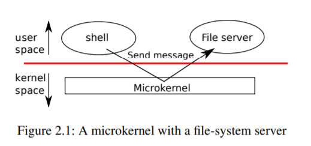
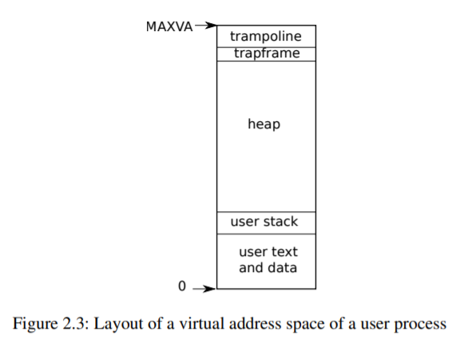

## 第二章--操作系统组织。

操作系统的一个关键要求是同时支持多个活动。例如，使用第1章中描述的系统调用接口，进程可以使用`fork`启动新进程。

操作系统必须在这些进程中“分时共享”计算机资源。例如，即使进程比硬件CPU多，操作系统也必须确保所有进程都取得进展。操作系统还必须安排进程之间的“隔离”。也就是说，如果一个进程有错误并失败，它不应该影响不依赖于失败进程的进程。然而，完全隔离太强了，因为进程应该可以故意交互；管道就是一个例子。因此，操作系统必须满足三个要求：多路复用、隔离和交互。

本章概述了如何组织操作系统以满足这三个要求。有很多方法可以做到这一点，但本文关注的是主流设计，它围绕着一个被许多Unix操作系统使用的“单片内核”。本章还概述了xv6进程，它是xv6中的隔离单位，以及在xv6开始运行时创建第一个进程。

Xv6在多核RISC-V微处理器上运行，它的很多低级功能(例如，其进程实现)都特定于RISC-V。RISC-V是64位CPU，xv6是用“LP64”C编写的，这意味着C编程语言中的long(L)和指针(P)是64位的，而int是32位的。本书假设读者已经在一些架构上做了一些机器级编程，并将在出现时介绍特定于RISC-V的想法。RISC-V的一个有用的参考资料是“RISC-V阅读器：开放架构图集”[9]。用户级ISA[2]和特权体系结构[1]是官方规范。

本文通常指的是使用术语CPU(中央处理单元的首字母缩写)执行计算的硬件元件。其他文档(例如，RISC-V规范)也使用单词Processor、CORE和HART代替CPU。Xv6需要多核RISC-V硬件，即共享内存但并行执行独立程序的多个CPU。

本文有时使用术语“多处理器”作为多核的同义词，尽管前一个术语也可以指具有几个不同处理器芯片的计算机板。

一台完整的计算机中的CPU由支持硬件包围，其中大部分以I/O接口的形式存在。Xv6是为QEMU的“-machinevirt”选项模拟的支持硬件编写的。这包括RAM、包含引导代码的ROM、到用户键盘/屏幕的串行连接以及用于存储的磁盘。

### 2.1 物理资源抽象化。

当遇到操作系统时，人们可能会问的第一个问题是，为什么会有它？也就是说，可以将图1.2中的系统调用实现为应用程序链接的库。在这个计划中，每个应用程序甚至可以有自己的库来满足其需求。应用程序可以直接与硬件资源交互，并以最适合应用程序的方式使用这些资源(例如，实现高或可预测的性能)。一些嵌入式设备或实时系统的操作系统就是以这种方式组织的。

这种库方法的缺点是，如果有多个应用程序在运行，则这些应用程序必须行为良好。例如，每个应用程序必须定期放弃CPU，以便其他应用程序可以运行。如果所有应用程序彼此信任且没有错误，则这种协作分时方案可能是可以的。更典型的情况是应用程序之间不信任，并且有错误，因此人们通常希望比协作方案提供更强的隔离性。

要实现强隔离，最好禁止应用程序直接访问敏感的硬件资源，而是将资源抽象为服务。例如，应用程序仅通过打开、读取、写入和关闭系统调用与文件系统交互，而不是读取和写入原始磁盘扇区。这为应用程序提供了路径名的便利，并允许操作系统(作为接口的实现者)管理磁盘。

类似地，Unix在进程之间透明地切换硬件CPU，根据需要保存和恢复寄存器状态，因此应用程序不必知道分时。这种透明性允许操作系统共享CPU，即使某些应用程序处于无限循环中。

又如，Unix进程使用`exec`来构建其内存镜像，而不是直接与物理内存交互。这允许操作系统决定将进程放在内存中的什么位置；如果内存紧张，操作系统甚至可能将进程的一些数据存储在磁盘上。`exec`还为用户提供了存储可执行程序映像的文件系统的便利。

Unix进程之间的许多形式的交互都是通过文件描述符进行的。文件描述符不仅抽象出许多细节(例如，存储管道或文件中的数据的位置)，而且还以简化交互的方式进行定义。例如，如果管道中的一个应用程序出现故障，内核将为管道中的下一个进程生成文件结束信号。

如您所见，图1.2中的系统调用接口经过精心设计，既为程序员提供了方便，又提供了强隔离的可能性。Unix接口不是抽象资源的唯一方式，但事实证明它是一种非常好的方式。

### 2.2 用户模式、管理模式、系统调用。

强隔离需要应用程序和操作系统之间的硬边界。如果应用程序出错，我们不希望操作系统或其他应用程序失败。相反，操作系统应该能够清理出现故障的应用程序并继续运行其他应用程序。要实现强隔离，操作系统必须安排应用程序不能修改(甚至不能读取)操作系统的数据结构和指令，并且应用程序不能访问其他进程的内存。

CPU为强隔离提供硬件支持。例如，RISC-V有三种CPU可以执行指令的模式：`机器模式、管理模式和用户模式`。在机器模式下执行的指令具有完全权限；CPU在机器模式下启动。机器模式主要用于配置计算机。Xv6在机器模式下执行几行，然后切换到管理模式。

在管理程序模式下，允许CPU执行“特权指令”：例如，启用和禁用中断、读取和写入保存页表地址的寄存器等。如果用户模式下的应用程序试图执行特权指令，则CPU不会执行该指令，而是切换到管理程序模式，以便管理程序模式代码可以终止应用程序，因为它做了一些不应该做的事情。第1章中的图1.1说明了该组织。应用程序只能执行用户模式指令(例如，添加数字等)。并且被称为运行在‘用户空间’中，而处于管理模式下的软件也可以执行‘特权指令’，并且被称为运行在‘内核空间’中。在`内核空间`(或管理模式)下运行的软件称为`内核`。

想要调用内核函数(例如，xv6中的`read`系统调用)的应用程序必须转换到内核。CPU提供特殊指令，将CPU从用户模式切换到管理模式，并在内核指定的入口点进入内核。(RISC-V为此提供了`ecall`指令。)。一旦CPU切换到管理模式，内核就可以验证系统调用的参数，决定是否允许应用程序执行请求的操作，然后拒绝或执行该操作。重要的是，内核控制转换到管理模式的入口点；如果应用程序可以决定内核入口点，则恶意应用程序可能例如在跳过参数验证的点进入内核。

### 2.3 内核组织。

一个关键的设计问题是操作系统的哪个部分应该在管理程序模式下运行。一种可能性是整个操作系统驻留在内核中，因此所有系统调用的实现都在管理模式下运行。这个组织被称为“铁板一块的内核”。

在此组织中，整个操作系统以完全硬件权限运行。这种组织方式很方便，因为操作系统设计人员不必决定操作系统的哪个部分不需要完全硬件权限。此外，操作系统的不同部分之间可以很容易地进行协作。例如，操作系统可能具有可由文件系统和虚拟内存系统共享的缓冲区高速缓存。

单一组织的缺点是操作系统不同部分之间的接口通常很复杂(正如我们将在本文的其余部分中看到的那样)，因此操作系统开发人员很容易出错。在‘单片内核’中，错误是致命的，因为在Supervisor模式下的错误经常会导致内核失败。如果内核失败，计算机将停止工作，因此所有应用程序也会失败。计算机必须重新启动才能重新启动。

为了降低内核出错的风险，操作系统设计人员可以最大限度地减少在管理模式下运行的操作系统代码量，并在用户模式下执行大部分操作系统。这种内核组织称为“微内核”。

图2.1说明了这种微内核设计。在图中，文件系统作为用户级进程运行。作为进程运行的操作系统服务称为服务器。为了允许应用程序与文件服务器交互，内核提供了进程间通信机制，以便将消息从一个用户模式进程发送到另一个用户模式进程。例如，如果像shell这样的应用程序想要读或写文件，它会向文件服务器发送一条消息并等待响应。

在微内核中，内核接口由一些低级函数组成，用于启动应用程序、发送消息、访问设备硬件等。这种组织方式使内核相对简单，因为大多数操作系统驻留在用户级服务器中。

与大多数Unix操作系统一样，Xv6被实现为“单片内核”。因此，xv6内核接口对应于操作系统接口，并且内核实现完整的操作系统。由于xv6没有提供很多服务，所以它的内核比一些微内核要小，但从概念上讲，xv6是单片的。

### 2.4 编码：xv6组织。

xv6内核源文件位于kernel/子目录中。按照模块化的粗略概念，将源代码划分为文件；图2.2列出了文件。每个模块的接口在defs.h(kernel/defs.h)中定义。

### 2.5 流程概述。

xv6(与其他Unix操作系统一样)中的隔离单位是一个过程。进程抽象防止一个进程破坏或窥探另一个进程的内存、CPU、文件描述符等。它还防止进程破坏内核本身，因此进程不能破坏内核的隔离机制。内核必须小心地实现进程抽象，因为有缺陷或恶意的应用程序可能会欺骗内核或硬件做一些不好的事情(例如，绕过隔离)。内核用来实现进程的机制包括用户/管理程序模式标志、地址空间和线程的时间切片。

File          | Description
--------------|-------------------------------------------
bio.c         | Disk block cache for the file system.
console.c     | Connect to the user keyboard and screen.
entry.S       | Very first boot instructions.
exec.c        | exec() system call.
file.c        | File descriptor support.
fs.c          | File system.
kalloc.c      | Physical page allocator.
kernelvec.S   | Handle traps from kernel, and timer interrupts.
log.c         | File system logging and crash recovery.
main.c        | Control initialization of other modules during boot.
pipe.c        | Pipes.
plic.c        | RISC-V interrupt controller.
printf.c      | Formatted output to the console.
proc.c        | Processes and scheduling.
sleeplock.c   | Locks that yield the CPU.
spinlock.c    | Locks that don’t yield the CPU.
start.c       | Early machine-mode boot code.
string.c      | C string and byte-array library.
swtch.S       | Thread switching.
syscall.c     | Dispatch system calls to handling function.
sysfile.c     | File-related system calls.
sysproc.c     | Process-related system calls.
trampoline.S  | Assembly code to switch between user and kernel.
trap.c        | C code to handle and return from traps and interrupts.
uart.c        | Serial-port console device driver.
virtio_disk.c | Disk device driver.
vm.c          | Manage page tables and address spaces.

> Figure 2.2: Xv6 kernel source files.

为了帮助实施隔离，进程抽象给程序提供了一种错觉，即它有自己的私有计算机。进程向程序提供其他进程无法读取或写入的似乎是私有内存系统或“地址空间”的东西。进程还向程序提供似乎是它自己的CPU来执行程序的指令。

Xv6使用页表(由硬件实现)为每个进程提供自己的地址空间。RISC-V页表将“虚拟地址”(RISC-V指令操作的地址)转换(或“映射”)为“物理地址”(CPU芯片发送到主内存的地址)。

Xv6为定义该进程地址空间的每个进程维护单独的页表。如图2.3所示，地址空间包括从虚拟地址零开始的进程的“用户内存”。指令首先出现，然后是全局变量，然后是堆栈，最后是进程可以根据需要扩展的“堆”区域(对于malloc)。Xv6在RISC-V上运行，虚拟地址使用39位，但仅使用38位。因此，最大地址是2^38Riscv1=0x3fffffffff，即MAXVA(−/riscv.h：349)。在地址空间的顶部，xv6保留了一个用于蹦床 (跳轉) 的页面和一个映射进程陷阱帧以切换到内核的页面，我们将在第4章中解释。

xv6内核维护每个进程的许多状态，并将这些状态收集到一个“struct proc”(kernel/proc.h：86)中。进程最重要的内核状态是它的页表、内核堆栈和运行状态。我们将使用符号`p->xxx`来引用process结构的元素。上面提到的陷阱帧是`p->tf`。

每个进程都有一个执行线程(或简称“线程”)来执行进程的指令。线程可以挂起，稍后再恢复。为了在进程之间透明地切换，内核挂起当前运行的线程并恢复另一个进程的线程。线程的大部分状态(局部变量、函数调用返回地址)存储在线程的堆栈中。每个进程有两个堆栈：用户堆栈和内核堆栈(`p->kstack`)。当进程执行用户指令时，只有它的用户堆栈在使用，而它的内核堆栈是空的。当进程进入内核时(对于系统调用或`interrupt`)，内核代码在进程的内核堆栈上执行；当进程在内核中时，其用户堆栈仍然包含已保存的数据，但不会被活跃使用。进程的线程在主动使用其用户堆栈和内核堆栈之间交替。

内核堆栈是独立的(并且受用户代码保护)，因此即使进程破坏了它的用户堆栈，内核也可以执行。

进程可以通过执行RISC-V`ecall`指令进行系统调用。此指令提高硬件特权级别，并将程序计数器更改为内核定义的入口点。入口点的代码切换到内核堆栈并执行实现系统调用的内核指令。当系统调用完成时，内核通过调用`sret`指令切换回用户堆栈并返回用户空间，这会降低硬件特权级别，并在系统调用指令之后立即恢复执行用户指令。进程的线程可以在内核中“阻塞”以等待I/O，并在I/O完成时从中断的位置恢复。

`p->state`表示进程是已分配的、准备运行的、正在运行的、等待I/O的、还是正在退出的。

`p->pagetable`以RISC-V硬件期望的格式保存进程的页表。xv6使分页硬件在用户空间中执行进程时使用该进程的`p->pagettable‘。进程的页表还用作分配用于存储进程内存的物理页地址的记录。

### 2.6 代码：启动xv6和第一个进程。

为了使xv6更具体，我们将概述内核如何启动和运行第一个进程。后续章节将更详细地描述本概述中显示的机制。

当RISC-V计算机通电时，它会自行初始化并运行存储在只读存储器中的引导加载程序。引导加载程序将xv6内核加载到内存中。然后，在机器模式下，CPU从at_entry(kernel/entry.S：12)开始执行xv6。Xv6开始时禁用了RISC-V分页硬件：虚拟地址直接映射到物理地址。

加载程序将xv6内核加载到物理地址0x80000000的内存中。它将内核放在0x80000000而不是0x0的原因是因为地址范围0x0：0x80000000包含I/O设备。

_entry的指令设置了一个堆栈，以便xv6可以运行C代码。Xv6在filestart.c(kernel/start.c：11)中声明初始堆栈stack0的空间。因为RISC-V上的堆栈向下增长，所以_entry的代码使用堆栈顶部地址stack0+4096加载堆栈指针寄存器sp.。现在我们有了一个堆栈，_entry在start(kernel/start.c：21)处调用C代码。

功能START执行一些仅在机器模式下允许的配置，然后切换到管理模式。要进入管理模式，RISC-V提供指令MRET。此指令最常用于从上一次调用从管理程序模式返回到机器模式。startisn不是从这样的调用返回，而是将事情设置得好像已经有过一样：它在寄存器mstatus中将先前的特权模式设置为Supervisor，通过将‘main’的地址写入寄存器 `mepc` 将返回地址设置为‘main’，通过将0写入页表寄存器`satp`来禁用管理程序模式下的虚拟地址转换，并将所有中断和异常委托给管理程序模式。

在进入管理模式之前，START执行另一项任务：它对时钟芯片进行编程以生成定时器中断。在此内务处理结束后，通过调用mret开始“返回”到主管模式。这会导致程序计数器更改为main(kernel/`main`.c：11)。

`main`(kernel/main.c：11)初始化多个设备和子系统后，通过调用userinit(kernel/proc.c：197)创建第一个进程。第一个进程执行一个小程序`initcode.S`(user/initcode.S：1)，它通过调用`exec`系统调用重新进入内核。正如我们在第1章中看到的，`exec`用新程序(在本例中为/init)替换当前进程的内存和寄存器。内核完成`exec`后，返回用户空间并运行/init.Init(user/init.c：11)根据需要创建一个新的控制台设备文件，然后将其作为文件描述符0、1和2打开。然后它循环，启动控制台外壳，处理孤立的僵尸，直到外壳退出，然后重复。系统启动了。

### 2.7 真实世界。

在现实世界中，人们既可以找到“单片内核”，也可以找到“微内核”。许多Unix内核都是单一的。例如，Linux有一个“单片内核”，尽管有些操作系统功能是作为用户级服务器运行的(例如，窗口系统)。像L4、Minix和QNX这样的内核被组织成一个带有服务器的微内核，并且在嵌入式环境中得到了广泛的部署。

大多数操作系统都采用了进程概念，并且大多数进程看起来与xv6的进程相似。然而，现代操作系统支持一个进程中的多个线程，以允许单个进程利用多个CPU。在一个进程中支持多个线程涉及很多xv6没有的机制，包括潜在的接口更改(例如，Linux的克隆，“fork`”的变体)，以控制进程线程的哪些部分共享。

### 2.8 练习。

1.您可以使用gdb观察第一次内核到用户的转换。运行QEMU-GDB。在同一目录下的另一个窗口中，rungdb。键入gdb命令Break*0x3ffffff07e，该命令在内核中跳转到用户空间的`sret`指令处设置断点。键入Continue gdb命令。gdb应该在断点处停止，即将执行`sret`。键入stepI。gdb现在应该指示它在地址0x4处执行，该地址位于用户空间中的`initcode.S`开头。

