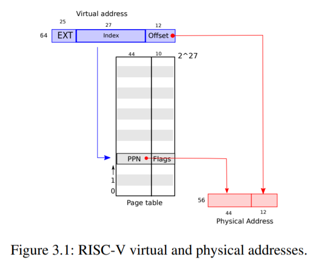
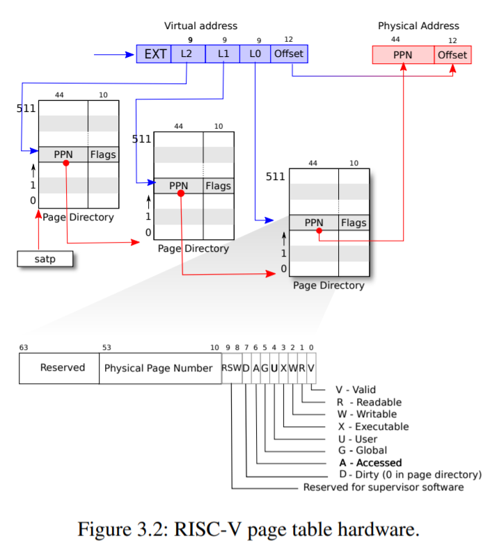
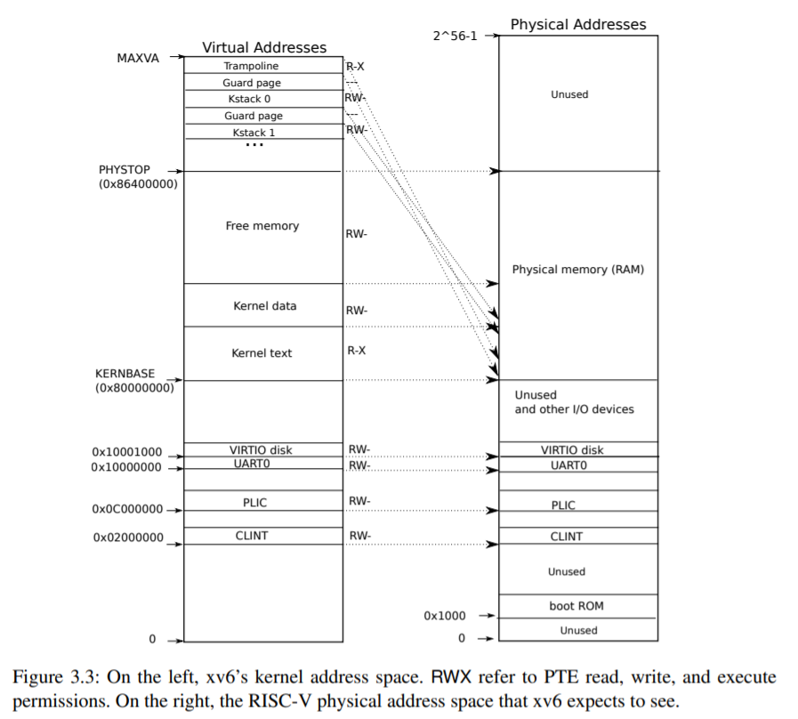
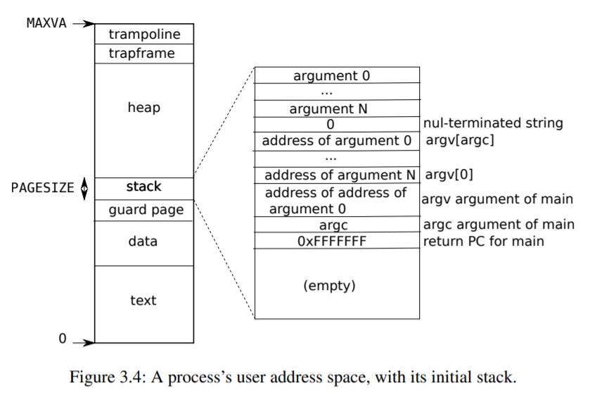

## 第三章--页表。

页表是操作系统为每个进程提供其自己的私有地址空间和内存的机制。页表确定内存地址的含义，以及物理内存的哪些部分可以访问。它们允许xv6隔离不同进程的地址空间，并将它们多路复用到单个物理内存上。页表还提供了一个间接级别，允许xv6执行一些技巧：在几个地址空间中映射相同的内存(蹦床页面)，并使用未映射的页面保护内核和用户堆栈。本章的其余部分说明RISC-V硬件提供的页表以及xv6如何使用它们。

### 3.1寻呼硬件。

提醒一下，RISC-V指令(用户和内核)操作虚拟地址。机器的RAM或物理内存用物理地址编制索引。RISC-V页表硬件通过将每个虚拟地址映射到一个物理地址来连接这两种地址。

xv6在Sv39 RISC-V上运行，Sv39 RISC-V具有39位虚拟地址(参见图3.1)。64位虚拟地址的前25位未使用。在此Sv39配置中，RISC-V页表在逻辑上是227(134,217,728)‘页表条目’(PTE)的数组。每个PTE包含44位物理页号(PPN)和一些标志。寻呼硬件通过使用39位的最高27位来索引到页表中以找到PTE，并制作其最高44位来自PTE中的PPN并且其最低12位从原始虚拟地址复制的56位物理地址来转换虚拟地址。因此，页表以4096(212)字节的对准块的粒度向操作系统提供对虚拟到物理地址转换的控制。这样的块称为页面。

在Sv39 RISC-V中，虚拟地址的前25位不用于转换；将来，RISC-V可能会使用这些位来定义更多级别的转换。同样，物理地址也有增长空间；在Sv39中，它是56位，但可以增长到64位。

如图3.2所示，实际转换分三个步骤进行。页表作为三级树存储在物理内存中。树的根是一个4096字节的页表页，其中包含512个PTE，这些PTE包含树的下一级页表页的物理地址。这些页面中的每一页都包含树中最后一级的512个PTE。寻呼硬件使用27位中的最高9位来选择根PTE表页面中的PTE，中间9位来选择树的下一级中的页面表页面中的PTE，并且底部9位来选择最终PTE。



如果转换地址所需的三个PTE中的任何一个都不存在，则寻呼硬件会引发故障。这种三级结构允许页表在大范围的虚拟地址没有映射的常见情况下省略整个页表页。

每个PTE包含告诉寻呼硬件如何允许使用相关联的虚拟地址的标志位。`PTE_V`表示PTE是否存在：如果没有设置，则引用页面会导致错误(即不允许)。`PTE_R`控制是否允许指令读取页面。`PTE_W`控制是否允许指令写入页面。`PTE_X`控制CPU是否可以将页面内容解释为指令并执行它们。`PTE_U`控制是否允许用户模式下的指令访问页面；如果没有设置`PTE_U`，则PTE只能在Supervisor模式下使用。图3.2显示了它是如何工作的。标志和所有其他页面硬件相关结构在(kernel/riscv.h)中定义。

要告诉硬件使用页表，内核必须将根页表页的物理地址写入`satp`寄存器。每个CPU都有自己的`satp`。CPU将使用它自己的“satp`”指向的页表转换由后续指令生成的所有地址。

每个CPU都有自己的‘satp’，因此不同的CPU可以运行不同的进程，每个进程都有一个由其自己的页表描述的私有地址空间。

关于术语的几点注意事项。物理内存是指DRAM中的存储单元。物理内存的一个字节有一个地址，称为物理地址。指令仅使用虚拟地址，分页硬件将其转换为物理地址，然后将其发送到DRAM硬件以读取或写入存储。虚拟内存是指内核提供的用于管理物理内存和虚拟地址的抽象和机制的集合。




### 3.2内核地址空间。

内核有自己的页表。当进程进入内核时，xv6切换到内核页表，当内核返回到用户空间时，它切换到用户进程的页表。内核的内存是私有的。

图3.3显示了内核地址空间的布局，以及从虚拟地址到物理地址的映射。文件(kernel/memlayout.h)声明了xv6内核内存布局的常量。

QEMU模拟包含I/O设备(如磁盘接口)的计算机。QEMU将设备接口作为内存映射控制寄存器向软件公开，这些寄存器位于物理内存中低于0x80000000的位置。内核可以通过读/写这些存储器位置与设备交互。第4章解释了xv6如何与设备交互。

内核对大多数虚拟地址使用身份映射；也就是说，内核的大部分地址空间都是“直接映射”的。例如，内核本身在虚拟地址空间和物理内存中都位于KERNBase。这种直接映射简化了内核代码，内核代码既需要读取或写入页面(使用其虚拟地址)，也需要操作引用相同页面(使用其物理地址)的PTE。有几个虚拟地址不是直接映射的：

-蹦床页面。它映射在虚拟地址空间的顶部；用户页表具有相同的映射。在第4章中，我们将讨论蹦床页面的作用，但是我们在这里看到了页表的一个有趣的用例；物理页面(保存蹦床代码)在内核的虚拟地址空间中映射了两次：一次在虚拟地址空间的顶部，一次在内核文本中。
-内核堆栈页。每个进程都有自己的内核堆栈，它被映射到很高的位置，因此xv6可以在其下面留下一个未映射的“防护页面”。保护页的PTE无效(即未设置`PTE_V`)，这确保了如果内核溢出内核堆栈，很可能会导致故障，内核会死机。如果没有保护页，溢出的堆栈将覆盖其他内核内存，从而导致不正确的操作。恐慌性崩盘更可取。



虽然内核通过高内存映射使用其堆栈，但是内核也可以通过直接映射地址访问它们。另一种设计可能只有直接映射，并在直接映射地址使用堆栈。然而，在该布置中，提供保护页将涉及取消映射否则将引用物理存储器的虚拟地址，该物理存储器将很难使用。

内核使用`PTE_R`和`PTE_X`权限映射蹦床页面和内核文本。内核从这些页面读取并执行指令。内核将其他页面映射为`PTE_R`和`PTE_W`权限，以便可以对这些页面中的内存进行读写。保护页的映射无效。

### 3.3代码：创建地址空间。

大多数用于操作地址空间和页表的xv6代码驻留在invm.c(kernel/vm.c：1)中。中心数据结构是pagetable_t，它实际上是指向RISC-V根页表页的指针；apagetable_t可以是内核页表，也可以是某个预处理页表。中心功能是WALK和MAP Pages，前者查找虚拟地址的PTE，后者为新映射安装PTE。以KVM开头的函数操作内核页表；以UVM开头的函数操作用户页表；其他函数同时用于两者。`copy out‘和copy in将数据复制到作为系统调用参数提供的用户虚拟地址，或者从用户虚拟地址复制数据；它们之所以是invm.c，是因为它们需要显式转换这些地址，以便找到相应的物理内存。

在引导序列的早期，`main`调用`kvminit`(kernel/vm.c：24)来创建内核的页表。此调用发生在xv6在RISC-V上启用分页之前，因此地址直接引用物理内存。Kvminit首先分配一页物理内存来保存根页面表页。然后调用`kvmmap`来安装内核需要的翻译。翻译包括内核的指令和数据、最高可达`PHYSTOP`的物理内存，以及实际为设备的内存范围。

kvmmap(kernel/vm.c：120)调用mappages(kernel/vm.c：151)，它将虚拟地址范围到相应物理地址范围的映射安装到页表中。它以页面间隔分别为范围内的每个虚拟地址执行此操作。对于要映射的每个虚拟地址，‘mappages`调用遍历以查找该地址的PTE地址。然后初始化PTE以保存相关的物理页号、所需的权限(`PTE_W`、`PTE_X`和/或`PTE_R`)和`PTE_V`以将PTE标记为`valid`(kernel/vm.c：163)。

walk(kernel/vm.c：74)模拟RISC-V分页硬件在PTE中查找虚拟地址(参见图3.2)。walkDownload 3级页表，每次9位。它使用每一级的9位虚拟地址来查找下一级页表或最后一页(kernel/vm.c：80)的PTE。如果PTE无效，那么所需的页面还没有分配；如果设置了allocargument，WALK将分配一个新的页表页面，并将其物理地址放入PTE。它返回树中最低层中PTE的地址(kernel/vm.c：90)。

上面的代码依赖于直接映射到内核虚拟地址空间的物理内存。例如，aswalk降低页表的级别，它从PTE(kernel/vm.c：82)中提取下一级页表的(物理)地址，然后使用该地址作为虚拟地址来获取下一级(kernel/vm.c：80)的PTE。

`main`调用`kvminithart`(kernel/vm.c：55)安装内核页表。它将根页表页的物理地址写入寄存器`satp`。此后，CPU将使用内核页表转换地址。由于内核使用身份映射，现在下一条指令的虚拟地址将映射到正确的物理内存地址。

从`main`调用的`procinit`(kernel/proc.c：24)为每个进程分配一个内核堆栈。它将每个堆栈映射到KSTACK生成的虚拟地址，从而为无效的堆栈保护页留出空间。`kvmmap`会将映射的PTE添加到内核页表中，调用`kvminithart`会将内核页表重新加载到`satp`中，以便硬件了解新的PTE。

每个RISC-V内核在一个‘转换后备缓冲器(TLB)’中缓存‘页表条目’，并且当xv6改变页表时，它必须告诉CPU使相应的缓存的TLB条目无效。如果没有，那么在以后的某个时刻，TLB可能会使用旧的缓存映射，指向同时已分配给另一个进程的物理页，因此，一个进程可能会在其他进程的内存上乱涂乱画。RISC-V有一个指令‘sfence.vma`，用于刷新当前内核的TLB。xv6在重新加载`satp`寄存器之后执行`fence.vmain``kvminithart`，以及在返回用户空间之前切换到用户页表的蹦床代码中(kernel/trampoline.S：79)。

### 3.4物理内存分配。

内核必须在运行时为页表、用户内存、内核堆栈和管道缓冲区分配和释放物理内存。

xv6使用内核末尾和`PHYSTOP`之间的物理内存进行运行时分配。它一次分配和释放整个4096字节的页面。它通过将链表贯穿页面本身来跟踪哪些页面是空闲的。分配包括从链接列表中移除页面；释放包括将释放的页面添加到列表。

### 3.5代码：物理内存分配器。

分配器驻留在kalloc.c(kernel/kalloc.c：1)中。分配器的数据结构是可供分配的物理内存页的列表。每个自由页面的列表元素都是一个`struct run`(kernel/kalloc.c：17)。分配器从哪里获得内存来保存该数据结构？它将每个空闲页面的运行结构存储在空闲页面本身中，因为那里没有存储任何其他内容。空闲列表受旋转锁保护(kernel/kalloc.c：21-24)。列表和锁被包装在结构中，以表明锁保护结构中的字段。现在，忽略锁和对`quire`和`release ase`的调用；第5章将详细研究锁定。

函数`main`调用`kinit`初始化分配器(kernel/kalloc.c：27)。`kinit`初始化空闲列表以保存内核末尾和`PHYSTOP`之间的每一页。xv6应该通过解析配置信息来确定有多少物理内存可用。相反，xv6假设机器有128MB的RAM。`kinit`通过对`kfre`的分页调用，调用`freerange`将内存添加到空闲列表中。PTE只能引用在4096字节边界(4096的倍数)上对齐的物理地址，因此`freerange`使用PGROUNDUP来确保它只释放对齐的物理地址。分配器开始时没有内存；这些对“kfree”的调用让它有一些内存需要管理。

分配器有时将地址视为整数，以便对它们执行算术(例如，遍历“freerange”中的所有页)，有时将地址用作读写内存的指针(例如，操作存储在每页中的非结构)；这种地址的双重使用是分配器代码充满C型转换的主要原因。另一个原因是释放和分配本身就会更改内存的类型。

函数`kfre`(kernel/kalloc.c：47)首先将释放的内存中的每个字节设置为值1。这将导致在释放内存(使用“悬挂引用”)后使用内存的代码读取垃圾，而不是旧的有效内容；希望这将导致此类代码更快地崩溃。

然后，`kfree‘将页面添加到空闲列表：它将一个指向`struct run`的指针抛给空闲列表，将空闲列表的旧开始记录在`r->next`中，并将空闲列表设置为等于tor。`kalloc`移除并返回空闲列表中的第一个元素。


### 3.6进程地址空间。

每个进程都有一个单独的页表，当xv6在进程之间切换时，它也会更改页表。如图2.3所示，进程的用户内存从虚拟地址零开始，可以增长到MAXVA(kernel/riscv.h：349)，允许进程原则上寻址256 GB的内存。

当进程向xv6请求更多用户内存时，xv6首先使用`kalloc`来分配物理页。然后，它将PTE添加到进程的页表中，这些页表指向新的物理页面。Xv6在这些PTE中设置`PTE_W`、`PTE_X`、PTE_R、PTE_U和PTE_V标志。大多数进程不使用整个用户地址空间；xv6在未使用的PTE中保留PTE_V。

我们在这里看到几个使用页表的很好的例子。首先，不同进程的页表将用户地址转换为不同的物理内存页面，因此每个进程都有私有的用户内存。其次，每个进程将其内存视为具有从零开始的连续虚拟地址，而进程的物理内存可以是非连续的。第三，内核在用户地址空间的顶部映射一个带有蹦床代码的页面，因此在所有地址空间中都会显示一页物理内存。

图3.4更详细地显示了xv6中执行进程的用户内存布局。堆栈是单个页面，并显示由exec创建的初始内容。包含命令行参数的字符串以及指向它们的指针数组位于堆栈的最顶端。其正下方是允许程序从`main`开始的值，就好像函数`main(argc，argv)`刚刚被调用一样。

要检测用户堆栈溢出分配的堆栈内存，xv6会在堆栈的正下方放置一个无效的保护页。如果用户堆栈溢出，并且进程尝试使用堆栈下面的地址，则硬件将生成页面错误异常，因为映射无效。现实中的操作系统可能会在用户堆栈溢出时自动为其分配更多内存。


。

### 3.7代码：sbrk。

sbrk系统调用一个进程来缩小或增加其内存。系统调用由函数growth proc(kernel/proc.c：224)实现。growth proc调用`uvmalloc`或uvmdealloc，具体取决于是正的还是负的。`uvmalloc`(kernel/vm.c：236)使用`kalloc`分配物理内存，并使用`mappages`将PTE添加到用户页表中。uvmdelloccall uvmunmap(kernel/vm.c：176)使用walk查找PTE，使用`kfre`释放它们引用的物理内存。

xv6使用进程的页表不仅告诉硬件如何映射用户虚拟地址，而且还作为向该进程分配了哪些物理内存页的唯一记录。这就是释放用户内存(Inuvmunmap)需要检查用户页表的原因。

### 3.8代码：exec。

`exec`是创建地址空间的用户部分的系统调用。它从存储在文件系统中的文件初始化地址空间的用户部分。`exec`(kernel/exec.c：13)使用Namei(kernel/exec.c：26)打开命名的二进制路径，这将在第7章解释，然后读取ELF头部。Xv6应用程序以(kernel/elf.h)中定义的广泛使用的`elf格式`描述。ELF二进制文件由ELF头`struct elfhdr`(kernel/elf.h：6)和后跟一系列程序段头struct proghdr(kernel/elf.h：25)组成。Eachproghdrr描述必须加载到内存中的应用程序的一部分；xv6程序只有一个程序部分标题，但其他系统可能有单独的指令和数据部分。

第一步是快速检查文件是否可能包含ELF二进制文件。ELF二进制文件以四个字节的“幻数”0x7F、.code‘E’、.code‘L’、.code‘F’或`ELF_MAGIC`(kernel/elf.h：3)开头。如果ELF标头具有正确的幻数，则execa假定二进制文件格式正确。

exec使用`proc_pagetable`(kernel/exec.c：38)分配没有用户映射的新页表，使用`uvmalloc`(kernel/exec.c：52)为每个ELF段分配内存，使用`loadSeg`(kernel/exec.c：10)将每个段加载到内存中。`loadSeg`使用`walkaddr`查找分配的内存的物理地址，在该地址写入ELF段的每一页，并读取该文件。

/init是使用`exec`创建的第一个用户程序，其程序节头如下：


```
# objdump -p _init

user/_init:      file format     elf64-littleriscv

Program Header:
    LOAD  off 0x00000000000000b0 vaddr 0x0000000000000000
                                    paddr 0x0000000000000000 align 2** 3
          filesz 0x0000000000000840 memsz 0x0000000000000858 flags rwx
    STACK off 0x0000000000000000 vaddr 0x0000000000000000
                                    paddr 0x0000000000000000 align 2** 4
          filesz 0x0000000000000000 memsz 0x0000000000000000 flags rw-
```

程序节头的filesz可能小于emsz，这表明它们之间的间隙应该用零填充(对于C全局变量)，而不是从文件中读取。对于/init，fileszis为2112字节，memszis为2136字节，因此‘uvmallocation’分配了足够的物理内存来容纳2136字节，但是只从file/init中读取了2112字节。

现在`exec`分配并初始化用户堆栈。它只分配一个堆栈页。`exec`一次复制一个参数字符串到堆栈顶部，并将指向它们的指针记录在`ustack`中。它在将要传递给`main`的argvlist的末尾放置一个空指针。`ustack`中的前三个条目是假的返回pc、argc和argvPointer。

“exec`”将一个不可访问的页放在堆栈页的正下方，因此尝试使用多个页的程序会出错。这个不可访问的页面还允许`exec`处理过大的参数；在这种情况下，`exec`用来将参数复制到堆栈的`copy out`(kernel/vm.c：361)函数会注意到目标页面不可访问，并返回1。
在准备新内存镜像的过程中，如果`exec`检测到无效程序段等错误，它会跳转到labelad，释放新镜像，并返回1。`exec`必须等待释放旧镜像，直到确定系统调用成功：如果旧镜像消失，系统调用不能向其返回1。`exec`中唯一的错误案例发生在镜像创建过程中。镜像完成后，`exec`可以提交到新的页表(kernel/exec.c：110)并释放旧的页表(kernel/exec.c：114)。

EXEC在ELF文件指定的地址将字节从ELF文件加载到内存中。用户或进程可以将他们想要的任何地址放入ELF文件。因此，“exec`”是有风险的，因为ELF文件中的地址可能指的是内核，可能是无意的，也可能是故意的。粗心大意的内核的后果可能从崩溃到恶意破坏内核的隔离机制(即安全漏洞)。xv6执行许多检查以避免这些风险。例如，if(ph.vaddr+ph.memsz<ph.vaddr)检查总和是否溢出64位整数。危险在于，用户可能使用指向用户选择的地址的aph.vaddr和ph.memsz构建ELF二进制文件，并且ph.memsz足够大，以至于总和溢出到0x1000，看起来像是一个有效值。在xv6的旧版本中，用户地址空间也包含内核(但在用户模式下不可读/写)，用户可以选择与内核内存相对应的地址，从而将数据从ELF二进制文件复制到内核。在xv6的RISC-V版本中，这种情况不会发生，因为内核有自己的单独页表；`loadSeg`加载到进程的页表中，而不是内核的页表中。

内核开发人员很容易省略一个重要的检查，而现实世界中的内核有很长一段遗漏检查的历史，用户程序可以利用这些检查的缺失来获取内核特权。很可能xv6没有完成验证提供给内核的用户级数据的工作，恶意用户程序可能会利用这些数据来绕过xv6的隔离。

### 3.9真实世界。

与大多数操作系统一样，xv6使用分页硬件进行内存保护和映射。大多数操作系统对分页的使用要比xv6复杂得多；例如，xv6缺少按需从磁盘分页、写入时复制分叉、共享内存、延迟分配的页面、自动扩展堆栈和内存映射文件。

RISC-V支持物理地址级别的保护，但xv6不使用该功能。

在具有大量内存的机器上，使用RISC-V对“超级页面”的支持可能是有意义的。当物理内存较小时，较小的页面才有意义，从而允许以细粒度将页面分配和调出到磁盘。例如，如果一个程序只使用8KB的内存，那么给它整整4MB的物理内存超级页是浪费的。较大的页面在具有大量RAM的机器上是有意义的，并且可能会减少页表操作的开销。

xv6内核缺少能够为小对象提供内存的类似于“malloc`”的分配器，这使得内核无法使用需要动态分配的复杂数据结构。

内存分配很早以前就是一个热门话题，最基本的问题是有效利用有限的内存，并为未知的未来请求做好准备[6]。今天，人们更关心速度而不是空间效率。此外，更精细的内核可能会分配许多不同大小的小块，而不是(如xv6中那样)只分配4096字节的块；真正的内核分配器需要处理小分配和大分配。

### 3.10练习。

1. 解析RISC-V的设备树以查找计算机拥有的物理内存量。
2. 通过调用`sbrk`(1)编写一个地址空间增加一个字节的用户程序。在调用`sbrk`之前和调用`sbrk`之后，运行程序并检查程序的页表。内核分配了多少空间？新内存的测试内容是什么？
3. 修改xv6为内核使用超级页面。
4. 修改xv6，以便用户程序在取消引用空指针时会收到错误。也就是说，修改xv6，这样就不会为用户程序映射虚拟地址0。
5. `exec`的UNIX实现传统上包含对shell脚本的特殊处理。如果要执行的文件以文本#！开头，则第一行被视为要运行以解释该文件的程序。例如，如果调用`exec`来运行myprog arg1，并且myprog的第一行是#！/interp，则`exec`运行/interpwith命令行/interp myprog arg1。在xv6中实现对此约定的支持。
6. 实现内核地址空间随机化。
