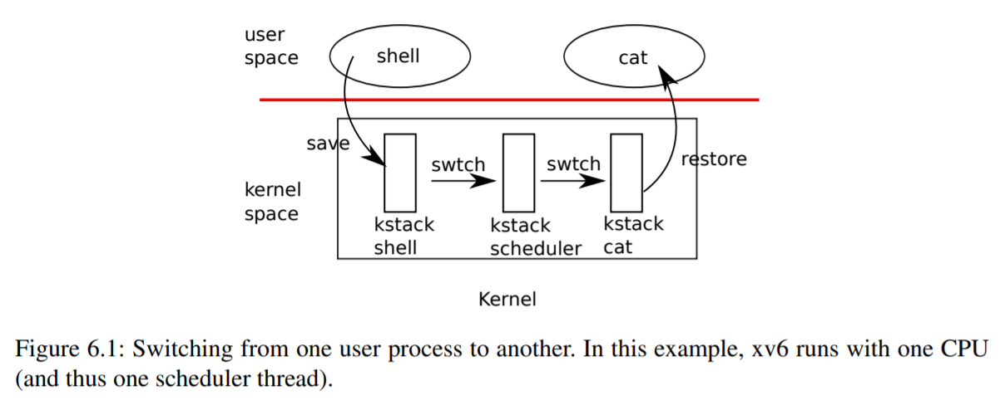

## 第6章--调度。

任何操作系统运行的进程都可能比计算机拥有的CPU多，因此需要制定计划在进程之间分时分配CPU。理想情况下，共享对用户进程是透明的。一种常见的方法是通过将进程“多路复用”到硬件CPU上，给每个进程提供一种它有自己的虚拟CPU的假象。本章解释xv6如何实现这种多路复用。

### 6.1复用。

Xv6通过在两种情况下将每个CPU从一个进程切换到另一个进程来实现多路复用。首先，xv6的`sleep`和`wakeup`机制在进程等待设备或管道I/O完成、等待子进程退出或等待`sleep`系统调用时切换。其次，xv6定期强制交换机处理长时间计算而不休眠的进程。这种多路复用产生了每个进程都有自己CPU的假象，就像xv6使用内存分配器和硬件页表来产生每个进程都有自己内存的假象一样。

实现多路复用带来了一些挑战。首先，如何从一个进程切换到另一个进程？虽然上下文切换的思想很简单，但其实现是xv6中一些最不透明的代码。第二，如何以对用户进程透明的方式强制切换？

Xv6使用用计时器中断驱动上下文切换的标准技术。第三，许多CPU可能同时在进程之间切换，需要一个锁定计划来避免争用。第四，进程退出时必须释放进程的内存和其他资源，但它不能自己完成所有这些操作，因为(例如)它不能在仍在使用内核堆栈的同时释放它自己的内核堆栈。第五，多核机器的每个核心必须记住它正在执行哪个进程，这样系统调用才能影响正确进程的内核状态。最后，`sleep`和`wakeup`允许一个进程放弃CPU，休眠等待事件，并允许另一个进程唤醒第一个进程。需要注意避免导致丢失`唤醒‘通知的争用。Xv6试图尽可能简单地解决这些问题，但是生成的代码仍然很棘手。



### 6.2代码：上下文切换。

图6.1概述了从一个用户进程切换到另一个用户进程所涉及的步骤：用户内核转换(系统调用或中断)到旧进程的内核线程，上下文切换到当前CPU的调度器线程，上下文切换到新进程的内核线程，以及陷阱返回到用户级进程。xv6调度器在每个CPU上都有一个专用线程(保存的寄存器和堆栈)，因为调度器在旧进程的内核堆栈上执行是不安全的：其他内核可能会唤醒进程并运行它，而在两个不同的内核上使用相同的堆栈将是一场灾难。在本节中，我们将研究在内核线程和调度程序线程之间切换的机制。从一个线程切换到另一个线程涉及保存旧线程的CPU寄存器，并恢复新线程以前保存的寄存器；保存和恢复堆栈指针和程序计数器的事实意味着CPU将切换堆栈并切换它正在执行的代码。

函数`swtch`执行内核线程切换的保存和恢复。`swtch`不直接了解线程；它只保存和恢复寄存器集，称为`contexts`。当某个进程需要放弃CPU时，该进程的内核线程会调用`swtch`保存自己的上下文并返回调度器上下文。每个上下文都包含在一个`struct context`(kernel/proc.h：2)中，它本身包含在进程的`struct proc`或CPU的`struct cpu`中。`swtch`有两个参数：`struct context*old`和`struct context*new`。它将当前寄存器保存在旧寄存器中，从新加载寄存器，然后返回。

让我们跟随一个通过`swtch`进入`Schedul`uler的过程。我们在第4章中看到，在中断结束时，有一种可能性是`usertrap`调用`yeeld`，也就是YEELDIN转而调用`Schedul`，后者调用`swtch`将当前上下文保存在`p->context`中，并切换到之前保存在`cpu->Scheduler`(kernel/proc.c：494)中的调度上下文。

`swtch`(kernel/swtch.S：3)只保存被调用方保存的寄存器；调用方保存的寄存器由调用C代码保存在堆栈上(如果需要)。`swtch`知道`struct context`中每个寄存器字段的偏移量。它不保存程序计数器。相反，`swtch`保存区域寄存器，该寄存器保存调用`swtch`的返回地址。现在，`swtch`从新的上下文恢复寄存器，新的上下文保存由前一个`swtch`保存的寄存器值。当`swtch`返回时，它返回到restoredraregister指向的指令，即新线程之前调用`swtch`的指令。此外，它在新线程的堆栈上返回。

在我们的示例中，`Schedul`调用`swtch`以切换到`cpu->Scheduler`，即每个CPU的调度器上下文。该上下文已由`Scheduler`对`swtch`(kernel/proc.c：460)的调用保存。当我们一直在跟踪的`swtch`返回时，它不是返回到`Schedul`而是返回到`Scheduler`，它的堆栈指针指向当前CPU的调度器堆栈。


### 6.3代码：调度。

最后一节介绍了`swtch`的低级细节；现在让我们将`swtch`作为给定的内容，并检查从一个进程的内核线程通过调度器切换到另一个进程。调度器以每个CPU一个特殊线程的形式存在，每个线程都运行‘Scheduler`函数。

此函数负责选择下一步要运行的进程。一个想要放弃CPU的进程必须获取它自己的进程锁`p->lock`，释放它持有的任何其他锁，更新它自己的状态(`p->state`)，然后调用`Sched`。Yeld(kernel/proc.c：500)遵循这个约定，就像我们稍后将研究的‘sleep`和`exit`一样。Schedule仔细检查这些条件(kernel/proc.c：484-489)，然后再检查这些条件的含义：既然持有了锁，最后，`调度`调用`swtch`将当前上下文保存在`p->context`中，切换到`cpu->Scheduler`中的调度器上下文。`swtch`在调度器的堆栈上返回，就像`Scheduler`的`swtch`已经返回一样(kernel/proc.c：460)。调度器继续for循环，找到要运行的进程，切换到该进程，然后循环重复。

我们刚刚看到xv6跨`swtch`调用持有`p->lock`：`swtch`的调用方必须已经持有锁，并且锁的控制权传递给切换到的代码。这种约定对于锁来说是不寻常的；通常获取锁的线程也负责释放锁，这使得对正确性的推理变得更容易。对于上下文切换，必须打破这一约定，因为在`swtch`中执行时，`p->lock`保护进程的状态和上下文字段上的不变量，这些不变量在`swtch`中执行时不为真。如果在`swtch`期间没有保持`p->lock`，则可能会出现问题的一个例子是：在设置了`yeeld`之后，不同的CPU可能决定运行该进程。
其状态为`RUNNABLE`，但在`swtch`导致其停止使用自己的内核堆栈之前。结果是两个CPU在同一堆栈上运行，这不可能是正确的。

内核线程总是放弃它的CPU，并且总是切换到调度器中的相同位置，而调度器(几乎)总是切换到以前称为‘Schedul`的某个内核线程。因此，如果要打印xv6切换线程的行号，可以看到以下简单模式：(kernel/proc.c：460)、(kernel/proc.c：494)、(kernel/proc.c：460)、(kernel/proc.c：494)等等。在两个线程之间进行这种程式化切换的过程有时称为“协作式”；在本例中，“调度”和“调度器”是彼此的协同例程。

在一种情况下，调度器对`swtch`的调用不会以`Schedul`结束。首次调度新进程时，从`forkret`(kernel/proc.c：512)开始。`Forkret`的存在是为了释放`p->lock`，否则新的进程可能会从`usertrapre`开始。

调度器(kernel/proc.c：442)运行一个简单的循环：找到一个要运行的进程，运行它，直到它产生结果，然后重复。调度程序遍历进程表，查找可运行的进程，该进程具有`p->state==RUNNABLE`。找到进程后，设置每个CPU的当前进程变量`c->proc`，将该进程标记为RUNNING，然后调用`swtch`开始运行(kernel/proc.c：455-460)。

考虑调度代码结构的一种方法是，它对每个进程强制实施一组不变量，并在这些不变量不为真时保持“p->lock”。一个不变量是，如果一个进程是RUNNING，则定时器中断的“yeeld”必须能够安全地从该进程切换出去；这意味着CPU寄存器必须保存该进程的寄存器值(即，`swtch`没有将它们移至acontext)，并且`c->proc`必须引用该进程。另一个不变量是，如果进程是`RUNNABLE`，则空闲CPU的‘调度器’运行它必须是安全的；这意味着`p->context`必须持有进程的寄存器(即，它们实际上不在实际寄存器中)，没有CPU在进程的内核堆栈上执行，并且没有CPU的`c->proc`引用该进程。请注意，当持有`p->lock`时，这些属性通常不为真。维护上述不变量是xv6经常在一个线程中`获取‘p->lock`，在另一个线程中释放，例如在`yeeld`中获取，在`Scheduler`中释放的原因。一旦`yeeld`开始修改正在运行的进程的状态，使其成为`RUNNABLE`，则必须保持锁定，直到恢复不变量：最早正确的释放点是在`Scheduler`(在自己的堆栈上运行)清除`c->proc`之后。类似地，一旦`Scheduler`开始将`RUNNABLE`进程转换为RUNNING，则在内核线程完全运行之前(例如`yeeld`中的`swtch`之后)，才能释放锁。

`p->lock`还可以保护其他东西：`exit`和`wait`之间的相互作用，避免丢失唤醒的机制(参见第6.5节)，以及避免退出的进程与读取或写入其状态的其他进程之间的竞争(例如，`exit`系统调用查看`p->pid`并设置`p->killed`(kernel/proc.c：596))。可能值得考虑的是，不同的功能。
为了清楚起见，或许也为了性能，可以将`p->lock`分开。

### 6.4代码：mycpu和myproc。

Xv6通常需要指向当前进程的procStructure的指针。在单处理器上，可以有一个指向currentproc的全局变量。这在多核机器上不起作用，因为每个核心执行不同的进程。解决此问题的方法是利用每个内核都有自己的寄存器集这一事实；我们可以使用其中一个寄存器来帮助查找每个内核的信息。

Xv6为每个CPU(kernel/proc.h：22)维护一个‘struct cpu`，它记录当前在该CPU上运行的进程(如果有)、为CPU的调度程序线程保存的寄存器，以及管理中断禁用所需的嵌套自旋锁数。函数`mycpu`(kernel/proc.c：58)返回指向当前CPU的`struct cpu`的指针。RISC-V对其CPU进行编号，给每个CPU一个“hartid”。Xv6确保每个CPU的‘hartid`在内核中存储在该CPU的stpregister中。

这允许`mycpu`使用设置对cpustructs数组进行索引，以找到正确的cpustructures数组。确保CPU‘stp始终持有CPU的’hartid‘有点麻烦。mstart在CPU启动序列的早期设置寄存器，同时仍处于机器模式(kernel/start.c：45)。
`usertrapre`保存在蹦床页面，因为用户进程可能会修改ytp。最后，用户在从用户空间进入内核时恢复保存的tp(kernel/trampoline.S：70)。

编译器保证永远不使用寄存器。如果RISC-V允许xv6直接读取当前的‘hartid’会更方便，但这仅在机器模式下允许，在管理模式下不允许。

cpuid和`mycpu`的返回值是脆弱的：如果计时器中断并导致线程屈服，然后移到不同的CPU，则以前的返回值将不再正确。为了避免这个问题，xv6要求调用方关闭中断，并在使用完返回的`struct cpu`后才启用中断。

函数`myproc`(kernel/proc.c：66)返回当前CPU上运行的进程的`struct proc`指针。`myproc`关闭中断，调用`mycpu`，从`struct cpu`中取出当前进程指针(`c->proc`)，然后启动中断。即使启用了中断，`myproc`的返回值也可以安全使用：如果定时器中断将调用进程移到不同的CPU，则其`struct proc`指针将保持不变。

### 6.5睡眠和唤醒。

调度和锁定有助于向另一个进程隐藏一个进程的存在，但是到目前为止，我们还没有帮助进程有意识地交互的抽象。已经发明了许多机制来解决这个问题。Xv6使用一个称为睡眠和`唤醒`的进程，允许一个进程休眠等待事件，而另一个进程在事件发生后将其唤醒。睡眠和‘唤醒’通常被称为‘序列协调’或‘条件同步’机制。

为了说明这一点，让我们考虑一种称为“信号量”[4]的同步机制，它协调生产者和消费者。信号量维护计数并提供两个操作。“V”操作(对于生产者)递增计数。“P”操作(针对消费者)等待，直到计数为非零，然后递减计数并返回。如果只有一个生产者线程和一个消费者线程，并且它们在不同的CPU上执行，并且编译器没有过多地进行优化，则此实现将是正确的：


```c
100 struct semaphore {
101   struct spinlock lock;
102   int count;
103 };
104
105 void
106 V(struct semaphore *s)
107 {
108   acquire(&s->lock);
109   s->count += 1;
110   release(&s->lock);
111 }
112
113 void
114 P(struct semaphore *s)
115 {
116   while(s->count == 0)
117     ;
118   acquire(&s->lock);
119   s->count -= 1;
120   release(&s->lock);
121 }
```

上面的实现代价很高。如果生产商很少采取行动，消费者将把大部分时间花在旋转上，同时希望得到一个非零的计数。消费者的CPU可以通过重复“轮询->计数”找到比“忙碌等待”更高效的工作。要避免忙碌的等待，使用者需要一种方法来让出CPU，并且仅在V递增计数之后才恢复。

这是朝着这个方向迈出的一步，尽管我们将看到这是不够的。让我们假设有两个调用，`sleep`和`wakeup`，它们的工作方式如下：睡眠(Chan)在任意值chan(称为‘等待通道’)上睡眠。休眠使调用进程进入休眠状态，释放CPU用于其他工作。wakeup(Chan)唤醒所有休眠Onchan的进程(如果有)，使它们的`sleep`调用返回。如果没有进程在等待Onchan，则`wakeup`不执行任何操作。我们可以将信号量实现更改为使用`sleep`和`wakeup`(更改以黄色突出显示)：


```c
200 void
201 V(struct semaphore *s)
202 {
203   acquire(&s->lock);
204   s->count += 1;
205   wakeup(s);
206   release(&s->lock);
207 }
208
209 void
210 P(struct semaphore *s)
211 {
212   while(s->count == 0)
213   sleep(s);
214   acquire(&s->lock);
215   s->count -= 1;
216   release(&s->lock);
217 }

```

p现在放弃CPU而不是旋转，这很好。然而，事实证明，使用这个接口设计“睡眠”和“唤醒”并不是直截了当的，而不会遇到所谓的“丢失唤醒”问题。假设P在第212行发现s->count==0`。当P在第212行和第213行之间时，V在另一个CPU上运行：它将‘s->count`更改为非零，并调用’wakeup`，后者发现没有休眠的进程，因此不执行任何操作。现在P在第213行继续执行：它调用‘sleep`并进入睡眠状态。这就产生了一个问题：P正在睡觉，等待已经发生的V呼叫。除非我们运气好，生产商再次调用V，否则即使计数不是零，消费者也会永远等待。

这个问题的根源在于，V恰好在错误的时刻运行，违反了P只有在s->count==0`时才休眠的不变量。保护不变量的不正确方式是在P中移动锁获取(下面以黄色突出显示)，以便它对计数的检查和对睡眠的调用是原子的：


```c
300 void
301 V(struct semaphore *s)
302 {
303   acquire(&s->lock);
304   s->count += 1;
305   wakeup(s);
306   release(&s->lock);
307 }
308
309 void
310 P(struct semaphore *s)
311 {
312   acquire(&s->lock);
313   while(s->count == 0)
314   sleep(s);
315   s->count -= 1;
316   release(&s->lock);
317 }

```

人们可能希望这个版本的P将避免丢失唤醒，因为锁阻止V在313和314行之间执行。它会这样做，但也会死锁：P在休眠时持有锁，因此V将永远阻塞，等待锁。

我们将通过更改`sleep`的接口来修复前面的方案：调用方必须将`条件锁`传递给`sleep`，这样才能在调用进程标记为`sleep`并等待休眠通道后释放锁。该锁将强制并发的V等待，直到P完成使自己进入睡眠状态，以便“唤醒”将找到正在睡眠的消费者并将其唤醒。一旦消费者再次唤醒，“睡眠”就会在返回之前重新获取锁。我们新的正确的`睡眠`/`唤醒`方案可以使用，如下所示(更改为黄色突出显示)：


```c
400 void
401 V(struct semaphore *s)
402 {
403   acquire(&s->lock);
404   s->count += 1;
405   wakeup(s);
406   release(&s->lock);
407 }
408
409 void
410 P(struct semaphore *s)
411 {
412   acquire(&s->lock);
413   while(s->count == 0)
414      sleep(s, &s->lock);
415   s->count -= 1;
416   release(&s->lock);
417 }

```

P持有‘s->lock’的事实防止了V在P检查`c->count`和调用‘sleep`之间试图唤醒它。但是，请注意，我们需要“sleep`”自动释放s->lock`，并使消费进程进入休眠状态。

### 6.6代码：睡眠和唤醒。

我们来看看`sleep`(kernel/proc.c：533)和`wakeup`(kernel/proc.c：567)的实现。其基本思路是让`sleep`将当前进程标记为`SLEEPING`，然后调用`Schedul`释放CPU；`wakeup`在给定的等待通道上查找正在`睡眠`的进程，并将其标记为`RUNNABLE`。`sleep`和`wakeup`的呼叫者可以使用任何相互方便的号码作为通道。Xv6通常使用等待过程中涉及的内核数据结构的地址。

睡眠获取`p->lock`(kernel/proc.c：544)。现在进入休眠状态的进程同时持有`p->lock`和lk。Holdinglk在调用方中是必需的(在本例中为P)：它确保了没有其他进程(在本例中为一个runningV)可以启动对`wakeup`(Chan)的调用。现在`sleep`持有`p->lock`，所以可以安全地`release ase`lk了：其他进程可能会开始调用`wakeup`(Chan)，但是`wakeup`会等待`quire``p->lock`，所以会一直等到`sleep`让进程进入睡眠状态，这样`wakeup`就不会错过`sleep`了。

有一个小的复杂情况：iflk与`p->lock`是同一锁，那么如果`sleep`试图获取`p->lock`，那么它会与自己死锁。但是如果调用`sleep`的进程已经持有`p->lock`，那么为了避免错过一个并发的`wakeup`，就不需要再做任何事情了。当`wait`(kernel/proc.c：567)使用`p->lock`调用`sleep`时，会出现这种情况。

现在`sleep`持有`p->lock`，没有其他锁，可以通过记录休眠通道，将进程状态改为`SLEEPING`，然后调用`Schedul`(kernel/proc.c：549-552)来使进程进入休眠状态。

稍后就会明白为什么在进程被标记为休眠之前不释放`p->lock`(由`Scheduler`释放)是非常重要的。

某个时候，某个进程会获取条件锁，设置睡眠者正在等待的条件，然后调用`wakeup`(Chan)。重要的是，在保持条件锁^1的同时调用`wakeup`。wakeupops遍历进程表(kernel/proc.c：567)。它获取它检查的每个进程的`p->lock`，这既是因为它可以操作该进程的状态，也是因为`p->lock`确保睡眠和`wakeup`不会彼此遗漏。当`wakeup`发现状态为`SLEEPING`的进程有Matchingchan时，它会将该进程的状态更改为`RUNNABLE`。下次调度程序运行时，它将看到该进程已准备好运行。

为什么`sleep`和`wakeup`的锁定规则可以保证睡眠进程不会错过`唤醒`？休眠进程从检查条件之前的某个点到标记为`SLEEPING`的点，持有条件锁或它自己的`p->lock`，或者两者都持有。调用`wakeup`的进程在`wakeup`的循环中持有这两个锁。因此，唤醒程序或者在消费线程检查条件之前使条件为真；或者在休眠线程被标记为`SLEEPING‘之后，唤醒程序的`wakeup`严格检查休眠线程。然后“唤醒”将看到休眠过程并将其唤醒(除非有其他东西先将其唤醒)。

有时会出现多个进程在同一通道上休眠的情况；例如，多个进程从管道中读取数据。只需调用“唤醒”就可以将它们全部唤醒。其中一个将首先运行并获取调用`sleep`时使用的锁，然后(对于管道)读取管道中等待的任何数据。其他进程将发现，尽管被唤醒，但没有要读取的数据。在他们看来，醒来是“虚假的”，他们必须再睡一次。因此，总是在检查条件的循环内调用`sleep`。

如果`sleep`/`wakeup`的两次使用不小心选择了同一个频道，也不会有什么坏处：它们会看到虚假的唤醒，但如上所述的循环可以容忍这个问题。`sleep`/`wakeup`的魅力很大程度上在于它既是轻量级的(不需要创建特殊的数据结构来充当睡眠通道)，又提供了一个间接层(调用者不需要知道他们正在与哪个特定进程交互)。

>注1)：严格来说，`wakeup`只跟在`quire`后面就足够了(即可以在`release`之后调用`wakeup`)。


### 6.7代码：管道。

使用`sleep`和`wakeup`同步生产者和消费者的一个更复杂的例子是xv6的管道实现。我们在第1章中看到了管道的接口：写入管道一端的字节被复制到内核缓冲区，然后可以从管道的另一端读取。

后续章节将研究围绕管道的文件描述符支持，但现在让我们看看`pipewrite`和`piperead`的实现。每个管道由一个`struct pipe`表示，其中包含alockand adatabuffer。字段nreadand nwrite计算从缓冲区读取和写入缓冲区的字节总数。缓冲区回绕：`buf[PIPESIZE-1]`之后写入的下一个字节是`buf[0]`。计数没有结束。此约定允许实现区分已满缓冲区(`nwrite==nREAD+PIPESIZE`)和空缓冲区(`nwrite==nread`)，但这意味着对缓冲区的索引必须使用`buf[nREAD%PIPESIZE]`，而不是仅使用`buf[nREAD]`(对于nwrite也是如此)。

假设对`piperead`和`pipewrite`的调用同时发生在两个不同的CPU上。pipewrite(kernel/pipe.c：77)首先获取管道的锁，该锁保护计数、数据及其关联的不变量。然后，piperead(kernel/pipe.c：103)也尝试获取锁，但无法获取。它在`quire`(kernel/splock.c：22)中旋转，等待锁定。当epilepead等待时，`pipewrite`循环正在写入的字节(`addr[0..n-1]`)，依次将每个字节添加到管道中(kernel/pipe.c：95)。在此循环期间，可能会发生缓冲区填满(kernel/pipe.c：85)的情况。在这种情况下，pipewrite写入`ecall`的`wakeup‘以警告任何休眠的读取器缓冲区中有数据等待的事实，然后在`&pi->nwrite`上休眠，等待读取器从缓冲区中取出一些字节。在使pipewrite的进程休眠的过程中，休眠’release ase`SPI->lock。

现在`pi->lock`可用，`piperead`设法获取它并进入它的临界点：它发现`pi->nREAD！=pi->nwrite`(kernel/pipe.c：110)(`pipewrite`进入休眠状态，因为`pi->nwrite==pi->nREAD+PIPESIZE`(kernel/pipe.c：85))，所以它落入了for。
循环，将数据复制到管道外(kernel/pipe.c：117)，并按复制的字节数递增n read。现在有那么多字节可供写入，因此管道读取调用`wakeup`(kernel/pipe.c：124)在任何休眠写入器返回之前将其唤醒。wakeup发现一个进程在&pi->nwrite上休眠，该进程正在运行‘pipewrite’，但在缓冲区填满时停止。它将该进程标记为`RUNNABLE`。

管道代码对读取器和写入器使用单独的休眠通道(`pi->nread`和`pi->nwrite`)；这可能会使系统在有大量读取器和写入器等待同一管道的不太可能的情况下更加有效。管道代码在检查休眠条件的循环中休眠；如果有多个读取器或写入器，除第一个唤醒的进程外，所有其他进程都将看到该条件为。
仍然是假的，又睡着了。

### 6.8代码：等待、退出、销毁。

Sleepand‘唤醒’可以用于多种等待。第一章介绍的一个有趣的例子是孩子的“出口”和父母的“等待”之间的相互作用。在孩子死亡时，父母可能已经在‘wait`中睡觉，或者可能正在做其他事情；在后一种情况下，随后对`wait`的调用必须观察到孩子的死亡，可能是在调用’exit‘很长一段时间之后。xv6记录孩子的死亡情况，直到观察到`wait`为止，就是`exit`将调用者置于`ZOMBIE`状态，直到家长的`wait`注意到，将孩子的状态更改为UNUSED，复制孩子的退出状态，并将孩子的进程ID返回给父进程。如果父进程先于子进程退出，则父进程会将子进程交给init进程，该进程将永久调用“wait`”；因此，每个子进程都有一个父进程要在它之后进行清理。主要的实现挑战是父子`wait`和`exit`以及退出和退出之间的竞争和死锁的可能性。

Wait使用调用进程的`p->lock`作为条件锁以避免丢失唤醒，并在启动时获取该锁(kernel/proc.c：383)。然后它扫描工艺表。如果找到处于`ZOMBIE`状态的子进程，则释放该子进程的资源及其procStructure，将该子进程的退出状态复制到提供给`wait`的地址(如果不是0)，并返回子进程ID。如果`wait`找到。
子进程(但没有一个)已经退出，它调用SLEEP等待其中一个退出(kernel/proc.c：430)，然后再次扫描。这里，`sleep`中释放的条件锁是等待进程的`p->lock`，也就是上面提到的特例。请注意，“wait`”通常持有两个锁；它在尝试获取任何子锁之前获取自己的锁；因此，所有xv6都必须服从相同的锁。
排序(父级，然后子级)，以避免死锁。

Wait查看每个进程的`np->parent`以查找其子进程。使用`np->parent`，不带`p->lock`，违反了共享变量必须加锁保护的惯例。np可能是当前进程的祖先，在这种情况下，获取n`p->lock`可能会导致死锁，因为这会违反上面提到的顺序。在这种情况下，检查没有锁的`np->parent`似乎是安全的；一个进程的parentfield只会被它的父进程更改，所以如果`np->parent==pis`为true，则该值不能更改，除非当前进程更改它。

exit(kernel/proc.c：318)记录退出状态，释放一些资源，给init进程任何子进程，在父进程处于‘wait’状态时唤醒父进程，将调用者标记为僵尸，并永久释放CPU。最后的序列有点棘手。退出进程在将其状态设置为`ZOMBIE`并唤醒父进程时必须持有其父进程的锁，因为父进程的锁是防止在‘wait`中丢失唤醒的条件锁。子进程还必须持有自己的`p->锁`，否则父进程可能会看到它处于`ZOMBIE`状态，并在它仍在运行时将其释放。

获取锁的顺序对于避免死锁非常重要：因为`wait`先于子锁获取父锁，所以`exit`必须使用相同的顺序。

`exit`调用专门的唤醒函数`wakeup1`，该函数仅唤醒父进程，并且仅当它在`wait`(kernel/proc.c：583)中休眠时才唤醒父进程。子进程在将其状态设置为`ZOMBIE`之前唤醒父进程可能看起来不正确，但这是安全的：虽然`wakeup`1可能会导致父进程运行，但`wait`中的循环直到子进程的`p->lock`被`Scheduler`释放后才能检查该子进程，所以`wait`直到`exit`将其状态设置为`ZOMBIE`(kernel/proc.c：371)之后才能查看正在退出的进程。

`exit`允许进程自行终止，kill(kernel/proc.c：596)允许一个进程请求另一个进程终止。KILL要直接销毁受害者进程太复杂了，因为受害者可能正在另一个CPU上执行，可能正处于内核数据结构更新的敏感序列中间。“杀手锏”的作用很小：它只会设置受害者的“p->死亡”，如果它在睡觉，它就会唤醒它。最终受害者会进入或离开内核，如果设置了`p->killed`，则`usertrap`中的代码将调用`exit`。如果受害者在用户空间中运行，它很快就会通过进行系统调用或因为计时器(或某些计时器)进入内核。
其他设备)中断。


如果受害者进程处于`睡眠‘状态，则kill对`wakeup`的调用会导致受害者从睡眠状态返回。这是潜在的危险，因为等待的条件可能不是真的。

但是，对`sleep`的xv6调用总是被封装在一段时间内，在`sleep`返回后重新测试条件。一些对`sleep`的调用也会在循环中测试`p->killed`，如果设置了当前的Activity，则放弃当前的Activity。只有在这样的放弃是正确的情况下，才会这样做。例如，管道读写代码(kernel/pipe.c：86)返回是否设置了KILL标志；最终代码将返回到TRAP，它将再次检查标志并退出。

一些xv6`sleep`循环不检查`p->kill`，因为代码处于应该是原子的多步系统调用的中间。virtio驱动程序(kernel/virtio_disk.c：242)就是一个例子：它不检查‘p->kill’，因为磁盘操作可能是文件系统保持正确状态所需的一组写操作之一。等待磁盘I/O时被终止的进程在完成当前系统调用并且`usertrap`看到已被终止标志之前不会退出。

### 6.9真实世界。

xv6调度器实现了一个简单的调度策略，它依次运行每个进程。这个策略被称为‘圆圈’。真正的操作系统实现了更复杂的策略，例如，允许进程具有优先级。其想法是，调度器将优先选择可运行的高优先级进程，而不是可运行的低优先级进程。这些策略可能很快就会变得复杂，因为通常会有相互竞争的目标：例如，运营人员可能还想要保证公平和高吞吐量。此外，复杂的策略可能会导致`优先级反转`、`护送`等意外交互。当低优先级进程和高优先级进程共享一个锁时，可能会发生优先级反转，当低优先级进程获取该锁时，可能会阻止高优先级进程取得进展。当许多高优先级进程正在等待获得共享锁的低优先级进程时，可能会形成一个等待进程的长队；一旦形成了一个队，它就可以持续很长一段时间。为了避免这类问题，在复杂的调度器中需要额外的机制。

休眠和`唤醒‘是一种简单有效的同步方式，但是还有很多其他的同步方式。所有挑战中的第一个挑战是避免我们在本章开始时看到的“迷失唤醒”问题。最初的Unix内核的“睡眠”简单地禁用了中断，这已经足够了，因为Unix运行在单CPU系统上。因为xv6运行在多处理器上，所以它为`sleep`添加了显式锁。FreeBSD的‘msleep`采用了同样的方法。方案9的“睡眠”使用了一个回调函数，该函数在睡眠前保持调度锁的情况下运行；该函数作为睡眠状况的最后一分钟检查，以避免丢失唤醒。Linux内核的“sleep`”使用称为等待队列的显式进程队列，而不是等待通道；该队列有自己的内部锁。

在`wakeup`中扫描整个进程列表，查找匹配chanan的进程效率较低。更好的解决方案是用数据结构(如Linux的等待队列)替换“睡眠”和“唤醒”中的机制，该数据结构保存在该结构上休眠的进程列表。计划9的“睡眠”和“醒来”将该结构称为交汇点或会合点。许多线程库引用与条件变量相同的结构；在该上下文中，操作`sleep`和`wakeup`称为`wait`和signal。所有这些机制都有相同的特点：休眠条件由休眠期间自动丢弃的某种锁来保护。

“唤醒”的实现唤醒在特定通道上等待的所有进程，情况可能是许多进程正在等待该特定通道。操作系统将调度所有这些进程，并且它们将竞相检查休眠条件。

以这种方式行为的进程有时被称为“雷鸣般的羊群”，最好避免这种情况。大多数条件变量的`wakeup`都有两个原语：Signal和Broadcast，前者唤醒一个进程，后者唤醒所有等待的进程。


信号量通常用于同步。该计数通常对应于管道缓冲区中可用的字节数或进程拥有的僵尸子进程数。使用显式计数作为抽象的一部分可以避免“丢失唤醒”问题：存在已发生的唤醒次数的显式计数。伯爵还避免了虚假唤醒和“雷鸣般的羊群”问题。

终止进程并清理它们在xv6中引入了很多复杂性。在大多数操作系统中，它甚至更加复杂，因为例如，受害者进程可能在内核内部处于休眠状态，而展开它的堆栈需要非常仔细的编程。许多操作系统使用显式的异常处理机制(如long jmp)展开堆栈。

此外，还有其他事件可能导致睡眠进程被唤醒，即使它等待的事件尚未发生。例如，当一个Unix进程处于休眠状态时，另一个进程可能会向其发送一个`signal`。在这种情况下，进程将从中断的系统调用返回，返回值为-1，错误代码设置为EINTR。应用程序可以检查这些值并决定执行什么操作。Xv6不支持信号，这种复杂性不会出现。

Xv6对kill的支持并不完全令人满意：有一些休眠循环可能应该检查“p->kill”。一个相关的问题是，即使对于检查`p->kill‘的’sleep`循环，`sleep`和kill之间也存在竞争；后者可能设置为‘p->kill’，并试图在受害者的循环检查`p->kill‘之后但在调用’sleep`之前唤醒受害者。如果出现此问题，受害者在其等待的条件出现之前不会注意到`p->killed`。这可能相当晚(例如，当virtio驱动程序返回受害者正在等待的磁盘块时)或从不返回(例如，如果受害者正在等待来自控制台的输入，但是用户没有键入任何输入)。

真正的操作系统会在固定时间内找到具有显式自由列表的自由进程结构，而不是在allocproc中进行线性时间搜索；为简单起见，xv6使用线性扫描。

### 6.10练习。

1. 睡眠必须检查lk！=&p->锁以避免死锁(kernel/proc.c：543-546)。假设特例通过替换

    if(lk != &p->lock){
      acquire(&p->lock);
      release(lk);
    }

成為

    release(lk);
    acquire(&p->lock);

这样做会打破“睡眠”。多么?。

2. 大部分进程清理可以通过`exit`或`wait`完成。原来关闭打开文件的一定是`exit`。为什么？答案与管道有关。
3. 在xv6中实现信号量，不使用`sleep`和`wakeup`(但可以使用自旋锁)。将xv6中`sleep`和`wakeup`的用法替换为信号量。判断一下结果。
4. 修复上面提到的kill和`sleep`的竞争，使得在受害者的睡眠循环检查`p->kill`之后，在调用`sleep`之前发生的异常会导致受害者放弃当前的系统调用。
5. 设计一个计划，使每个休眠循环都检查`p->已终止‘，例如，virtio驱动程序中的进程如果被另一个进程终止，可以快速从WHILE循环返回。
6. 修改xv6，在从一个进程的内核线程切换到另一个进程时，只使用一个上下文切换，而不是通过调度器线程切换。让位线程需要自己选择下一个线程并调用`swtch`。挑战将是防止多个内核意外地执行同一线程；获得正确的锁定；以及避免死锁。
7. 修改xv6的`Scheduler`，在没有进程可运行时使用RISC-VWFI(等待中断)指令。尝试确保在WFI中的任何时候，只要有可运行的进程等待运行，就不会有内核暂停。
8. 锁`p->lock`保护了很多不变量，当查看受`p->lock`保护的特定xv6代码时，很难判断强制执行的是哪个不变量。设计一个更干净的计划，把‘p->lock’分成几个锁。
