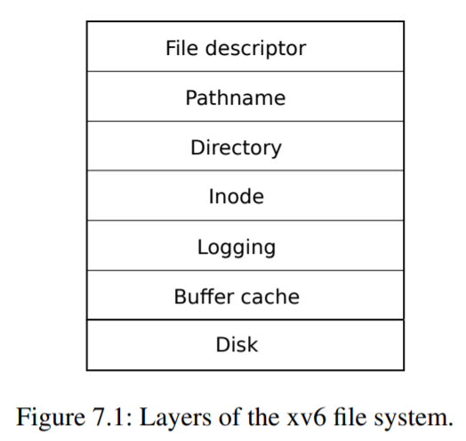
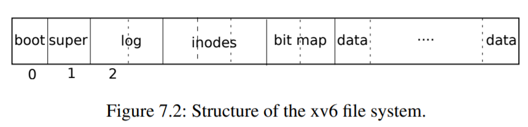
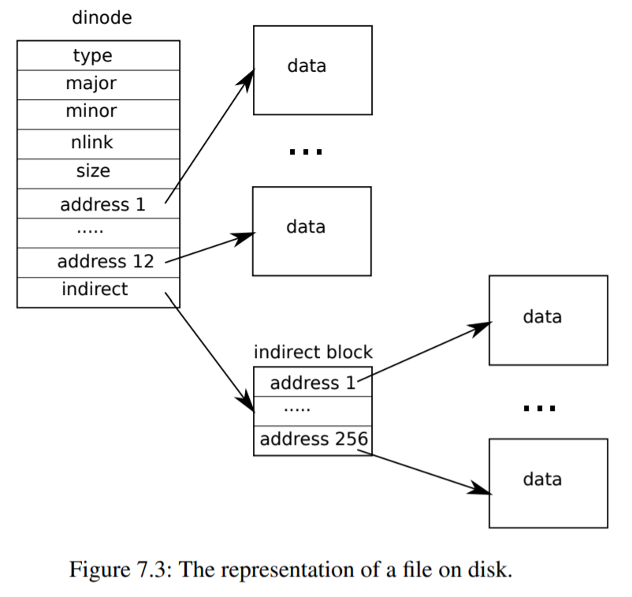

## 第七章--文件系统。

文件系统的目的是组织和存储数据。文件系统通常支持用户和应用程序之间的数据共享，以及`持久化‘，以便数据在重启后仍然可用。

xv6文件系统提供类Unix的文件、目录和路径名(请参见第1章)，并将其数据存储在virtio磁盘上以便于持久化(参见第4章)。该文件系统解决了几个挑战：

-文件系统需要磁盘上的数据结构来表示命名目录和文件的树，记录保存每个文件内容的块的身份，并记录磁盘的哪些区域是空闲的。
-文件系统必须支持`崩溃恢复`。也就是说，如果发生崩溃(例如，电源故障)，文件系统在重启后仍必须正常工作。风险在于崩溃可能会中断一系列更新并留下不一致的盘上数据结构(例如，在文件中既使用又标记为空闲的块)。
-不同的进程可能同时在文件系统上操作，因此文件系统代码必须协调以维护不变量。
-访问磁盘比访问内存慢几个数量级，因此文件系统必须维护常用数据块的内存缓存。

本章的其余部分解释xv6如何解决这些挑战。

### 7.1概述。

xv6文件系统实现被组织成七层，如图7.1所示。磁盘层读取和写入virtio硬盘驱动器上的块。缓冲区缓存层缓存磁盘块并同步对它们的访问，确保一次只有一个内核进程可以修改存储在任何特定块中的数据。日志记录层允许更高层将对多个块的更新包装在一个‘事务’中，并确保块在崩溃时自动更新(即，所有块都更新或不更新)。inode层提供单独的文件，每个文件都表示为具有唯一i编号的aninode和一些保存文件数据的块。目录层将每个目录实现为一种特殊类型的inode，其内容是一系列目录条目，每个条目都包含一个文件名和i-number。`pathname`层提供/usr/rtm/xv6/fs.c等分层路径名，并通过递归查找进行解析。文件描述符层抽象了许多Unix资源(例如，管道、设备、文件等)。使用文件系统接口，简化了应用程序员的工作。





文件系统必须为其在磁盘上存储信息节点和内容块的位置制定计划。为此，xv6将磁盘划分为几个部分，如图7.2所示。文件系统不使用块0(它保存引导扇区)。块1称为“超级块”；它包含有关文件系统的元数据(以块为单位的文件系统大小、数据块的数量、信息节点的数量和日志中的块的数量)。从2开始的块保存日志。日志之后是信息节点，每个数据块有多个信息节点。在这些之后是跟踪哪些数据块正在使用的位图块。其余的块是数据块；每个块在位图块中都标记为空闲，或者保存文件或目录的内容。`superblock`由一个单独的程序填充，该程序称为`mkfs`，它构建一个初始文件系统。

本章的其余部分将从缓冲区缓存开始讨论每一层。注意在较低层选择良好的抽象可以简化较高层的设计的情况。

### 7.2缓冲缓存层。

缓冲区缓存有两个任务：(1)同步对磁盘块的访问，以确保内存中只有一个块的副本，并且一次只有一个内核线程使用该副本；(2)缓存常用的块，以便不需要从慢速磁盘重新读取它们。密码是inbi.c。

缓冲区缓存导出的主界面由`bread`和`bwrite`两部分组成，前者获取包含可在内存中读取或修改的块副本的abu，后者将修改后的缓冲区写入磁盘上相应的块中。内核线程必须在使用完缓冲区后调用`brelse`来释放缓冲区。缓冲区缓存使用每缓冲区休眠锁，以确保每次只有一个线程使用每个缓冲区(也就是每个磁盘块)；`bread`返回一个锁定的缓冲区，而`brelse`释放该锁。




让我们回到缓冲区缓存。缓冲区高速缓存具有固定数量的缓冲区来保存磁盘块，这意味着如果文件系统请求缓存中尚未包含的块，则缓冲区高速缓存必须回收当前保存某个其他块的缓冲区。缓冲区高速缓存为新块回收最近最少使用的缓冲区。假设最近最少使用的缓冲区是最不可能很快再次使用的缓冲区。

### 7.3代码：缓冲区缓存。

缓冲区高速缓存是缓冲区的双向链表。`main`(kernel/main.c：27)调用的函数`binit`使用静态arraybuf(kernel/Bio.c：42-51)中的`NBUF`缓冲区初始化列表。所有其他对缓冲区缓存的访问都是通过`bcache.head`引用链表，而不是buf数组。

缓冲区有两个与之相关联的状态字段。字段`valid`表示缓冲区包含块的副本。字段盘指示缓冲器内容已被交给盘，这可能改变缓冲器(例如，将数据从盘写入数据)。

面包(kernel/bi.c：91)调用`bget`来获取给定扇区(kernel/bi.c：95)的缓冲区。如果需要从磁盘读取缓冲区，`bread`会在返回缓冲区之前调用`virtio_disk_rw`进行读取。

bget(kernel/bi.c：58)扫描缓冲区列表，查找具有给定设备和扇区编号(kernel/biic.c：64-72)的缓冲区。如果有这样的缓冲区，则`bget`获取该缓冲区的休眠锁，然后返回锁定的缓冲区。

如果给定扇区没有缓存缓冲区，则`bget`必须创建一个缓冲区，可能会重用保存不同扇区的缓冲区。它第二次扫描缓冲区列表，查找未使用的缓冲区(b->refcnt=0)；可以使用任何这样的缓冲区。bgetedBuffer元数据以记录新设备和扇区编号，并获取其休眠锁定。请注意，分配人`tb->valid=0`。
确保`bread`将从磁盘读取块数据，而不是错误地使用缓冲区以前的内容。

重要的是，每个磁盘扇区最多有一个缓存缓冲区，以确保读取器看到写入，并且因为文件系统使用缓冲区上的锁进行同步。`Bget`通过在第一个循环通过第二个循环声明现在缓存了块(通过设置dev、block no和refcnt)连续保持bache.lock来检查块是否被缓存，从而确保了这一不变性。这会导致检查块是否存在，并且(如果不存在)指定一个保存该块的缓冲区是原子的。
`bget`在bcache.lockCritical节外获取缓冲区的休眠锁是安全的，因为非零的`b->refcnt`会阻止缓冲区被重新用于不同的磁盘块。休眠锁保护块的缓冲内容的读取和写入，而bcache.lock保护有关哪些块被缓存的信息。

如果所有缓冲区都很忙，则说明同时执行文件系统调用的进程太多；`bget`死机。更优雅的响应可能是休眠，直到缓冲区空闲，尽管这样可能会出现死锁。

一旦`bread`读取了磁盘(如果需要)并将缓冲区返回给其调用方，调用方将独占使用该缓冲区，并可以读取或写入数据字节。如果调用方修改了缓冲区，则必须先调用`bwrite`将修改后的数据写入磁盘，然后才能释放缓冲区。Bwrite(kernel/bi.c：105)调用`virtio_disk_rw`与磁盘硬件对话。

调用方使用完缓冲区后，必须调用`brelse`将其释放。(`brelse`是b-release的缩写，名称隐晦，但值得学习：它起源于Unix，也在BSD、Linux和Solaris中使用。)Brelse(kernel/bi.c：115)释放休眠锁，并将缓冲区移到链表(kernel/bi.c：126-131)的前面。移动缓冲区会导致列表按照缓冲区最近使用(即释放)的程度进行排序：列表中的第一个缓冲区是最近使用的缓冲区，最后一个缓冲区是最近最少使用的缓冲区。

`bget`中的两个循环利用了这一点：在最坏的情况下，对现有缓冲区的扫描必须处理整个列表，但是首先检查最近使用的缓冲区(从`bcache.head`开始，然后是下一个指针)将在有良好的引用局部性时减少扫描时间。选择要重复使用的缓冲区的扫描通过向后扫描(遵循先行指针)来选择最近最少使用的缓冲区。

### 7.4记录层。

文件系统设计中最有趣的问题之一是“崩溃恢复”。出现该问题的原因是，许多文件系统操作涉及对磁盘的多次写入，而在写入的子集之后崩溃可能会使磁盘上的文件系统处于不一致的状态。例如，假设在文件截断期间发生崩溃(将文件长度设置为零并释放其内容块)。根据磁盘写入的顺序，崩溃可能会使inode具有对标记为空闲的内容块的引用，也可能会留下已分配但未引用的内容块。

后者相对较好，但引用释放的块的inode在重新引导后可能会导致严重问题。重新引导后，内核可能会将该块分配给另一个文件，现在我们有两个不同的文件无意中指向同一个块。如果xv6支持多个用户，这种情况可能是一个安全问题，因为旧文件的所有者将能够读写新文件中的块，而新文件由不同的用户拥有。

Xv6以一种简单的日志记录形式解决了文件系统操作期间的崩溃问题。

xv6系统调用不直接写入磁盘上的文件系统数据结构。取而代之的是，它将它希望进行的所有磁盘写入的描述放在磁盘上。一旦系统调用记录了它的所有写操作，它就会向磁盘写入一个特殊的“提交”记录，表明该日志包含一个完整的操作。此时，系统调用将写入复制到磁盘上的文件系统数据结构。在这些写入完成后，系统调用将擦除磁盘上的日志。

如果系统崩溃并重新启动，则在运行任何进程之前，文件系统代码将按如下方式从崩溃中恢复。如果日志标记为包含完整操作，则恢复代码会将写入复制到它们在磁盘文件系统中所属的位置。如果日志未标记为包含完整操作，则恢复代码将忽略该日志。恢复代码通过擦除日志结束。


为什么xv6的日志解决了文件系统操作中的崩溃问题？如果在操作提交之前发生崩溃，则磁盘上的日志将不会标记为完成，恢复代码将忽略它，并且磁盘的状态将如同操作尚未开始一样。如果崩溃发生在操作提交之后，则恢复将重放操作的所有写入，如果操作已开始将它们写入磁盘数据结构，则可能会重复这些写入。在任何一种情况下，日志都会使操作与崩溃相关：恢复后，操作的所有写操作要么都出现在磁盘上，要么一个都不出现。

### 7.5日志设计。

日志驻留在`超级块`中指定的已知固定位置。它由一个标题块和一系列更新的块副本(“记录的块”)组成。报头块包含扇区号阵列，每个记录块对应一个扇区号阵列，以及日志块计数。磁盘上标头块中的计数为零(表示日志中没有事务)或非零值(表示日志中包含具有指定记录块数的完整已提交事务)。Xv6在事务提交时(而不是在提交之前)写入头块，并在将记录的块复制到文件系统后将计数设置为零。因此，事务中途崩溃将导致日志头块中的计数为零；提交后的崩溃将导致非零计数。

每个系统调用的代码指示写入序列的开始和结束，该序列对于崩溃必须是原子的。为了允许不同进程并发执行文件系统操作，日志记录系统可以将多个系统调用的写入累积到一个事务中。

因此，单个提交可能涉及多个完整系统调用的写入。为避免在多个事务之间拆分系统调用，日志记录系统仅在没有文件系统系统调用正在进行时才提交。

同时提交几个事务的想法称为“组提交”。组提交减少了磁盘操作的数量，因为它在多个操作上摊销了提交的固定成本。GROUP COMMIT还可以同时向磁盘系统提交更多并发写入，可能允许磁盘在单个磁盘轮换期间将其全部写入。Xv6的virtio驱动不支持这种`Batching`，但是xv6的文件系统设计允许这种`Batching`。

Xv6在磁盘上专用固定数量的空间来保存日志。事务中系统调用写入的块总数必须适合该空间。这有两个后果。

日志中的空间不允许单个系统调用写入更多不同的块。

这对于大多数系统调用来说不是问题，但是其中有两个可能会写很多块：write和`unlink`。大型文件写入可能会写入许多数据块和许多位图块以及一个索引节点块；取消链接一个大型文件可能会写入许多位图块和一个索引节点。xv6的write系统调用将大的写操作分解成多个可以放入日志的小写操作，并且`unlink‘不会造成问题，因为实际上xv6文件系统只使用一个位图块。日志空间有限的另一个后果是，除非确定系统调用的写入适合日志中剩余的空间，否则日志记录系统无法允许系统调用启动。

### 7.6代码：日志记录。

日志在系统调用中的典型用法如下所示：


```c
begin_op();
...
bp = bread(...);
bp->data[...] = ...;
log_write(bp);
...
end_op();
```


`egin_op`(kernel/log.c：126)会一直等待，直到日志记录系统当前未提交，并且有足够的未保留日志空间来保存来自此调用的写入。log.outful统计已保留日志空间的系统调用的数量；保留空间的总数为log.outful乘以MAXOPBLOCKS。递增log.open既保留了空间，又防止在此系统调用期间发生提交。代码保守地假设每个系统调用最多可以写入MAXOPBLOCKS不同的块。

log_write(kernel/log.c：214)作为`bwrite`的代理。它将块的扇区号记录在内存中，在磁盘上的日志中保留一个槽，并将缓冲区固定在块高速缓存中，以防止块高速缓存将其逐出。在提交之前，块必须保留在高速缓存中：在此之前，高速缓存的副本是修改的唯一记录；在提交之前，不能将其写入其在磁盘上的位置；同一事务中的其他读取必须看到修改。当一个块在单个事务中被多次写入时，`log_write`会注意到，并将该块分配到日志中的同一个槽中。这种优化通常被称为吸收。例如，包含多个文件的索引节点的磁盘块在一个事务内被多次写入是很常见的。通过将多个磁盘写入吸收到一个中，文件系统可以节省日志空间，并且可以获得更好的性能，因为只需将磁盘块的一个副本写入磁盘。

`end_op`(kernel/log.c：146)首先递减未完成的系统调用计数。如果计数现在为零，则通过调用Commit()提交当前事务。此过程有四个阶段。write_log()(kernel/log.c：178)将事务中修改的每个块从缓冲区缓存复制到磁盘上日志中的槽。`write_head()`(kernel/log.c：102)写入头块。
到磁盘：这是提交点，写入后的崩溃将导致恢复重播日志中的事务写入。`install_trans`(kernel/log.c：69)从日志中读取每个块，并将其写入文件系统中的适当位置。最后，`end_op`写入计数为零的日志头；这必须在下一个事务开始写入记录的块之前发生，这样崩溃才不会导致使用一个事务的头和后续事务的记录块进行恢复。
`recover_from_log`(kernel/log.c：116)从`initlog`(kernel/log.c：55)中调用，在第一个用户进程运行(kernel/proc.c：524)之前开机时从`fsinit`(kernel/fs.c：43)中调用。它读取日志头，如果头指示日志包含提交的事务，则模仿`end_op`的操作。


日志使用示例出现在`filewrite`(kernel/file.c：135)中。事务处理如下所示：


```c
begin_op();
ilock(f->ip);
r = writei(f->ip, ...);
iunlock(f->ip);
end_op();
```


这段代码被包装在一个循环中，该循环将大量写入一次只有几个扇区的单个事务分解，以避免日志溢出。作为该事务的一部分，对`writei`的调用将写入许多块：文件的inode、一个或多个位图块和一些数据块。

### 7.7代码：块分配器。

文件和目录内容存储在必须从空闲池分配的磁盘块中。xv6的块分配器在磁盘上维护一个空位图，每个块一个位。零位表示对应的块是空闲的；一位表示它正在使用中。程序‘mkfs’设置对应于引导扇区、‘超级块’、日志块、索引节点块和位图块的位。

块分配器提供两个功能：`balloc`分配一个新的磁盘块，`bfree`释放一个块。ballocat(kernel/fs.c：72)的`balloc`中的循环考虑从块0开始到文件系统中的块数tob.size的每个块。它查找位图位为零的块，表示它是空闲的。如果`balloc`找到这样的块，它会更新位图并返回该块。为了提高效率，循环被分成两部分。外部循环读取每个位图位块。内部循环检查单个位图块中的所有BPBbit。缓冲区缓存一次只允许一个进程使用任何一个位图块的事实防止了两个进程试图同时分配块时可能发生的争用。

bfree(kernel/fs.c：91)查找右位图块并清除右位。同样，`bread`和`brelse`暗示的独占使用避免了显式锁定的需要。

与本章剩余部分描述的大部分代码一样，必须在事务内调用`balloc`和`bfre`。

### 7.8 inode层。

Terodecan有两个相关的含义之一。它可能指的是包含文件大小和数据块编号列表的磁盘数据结构。或者“inode”可能指的是内存中的inode，它包含磁盘上inode的副本以及内核中需要的额外信息。

磁盘上的信息节点被打包到称为信息节点块的磁盘连续区域中。每个inode的大小都相同，因此在给定数字n的情况下，很容易找到磁盘上的第n个inode。事实上，这个数字n称为inode编号或i-number，是实现中标识inode的方式。


磁盘上的inode由一个`struct dinode`(kernel/fs.h：32)定义。类型字段区分文件、目录和特殊文件(设备)。类型为零表示磁盘上的信息节点是空闲的。linkfield统计引用此inode的目录条目数，以便识别何时应释放磁盘上的inode及其数据块。size域记录文件中内容的字节数。地址数组记录保存文件内容的磁盘块的块号。

内核将活动inode集保存在内存中；`struct inode`(kernel/file.h：17)是磁盘上`struct dinode`的内存副本。只有当存在引用索引节点的C指针时，内核才会将该索引节点存储在内存中。该字段统计引用内存中索引节点的C指针的数量，如果引用计数降至零，则内核从内存中丢弃该索引节点。

`iget`和`iput`函数获取并释放指向inode的指针，修改引用计数。指向inode的指针可以来自文件描述符、当前工作目录和临时内核代码(如`exec`)。

在xv6的inode代码中有四种锁或类似锁的机制。`icache.lock`保护inode在缓存中最多出现一次的不变量，以及缓存的inode的refffield计算指向缓存的inode的内存指针数的不变量。每个内存中的inode都有一个包含休眠锁的alockfield，这确保了对inode的字段(如文件长度)以及inode的文件或目录内容块的独占访问。如果索引节点的ref大于零，则会导致系统在缓存中维护该索引节点，并且不会为不同的索引节点重用缓存条目。最后，每个inode都包含一个linkfield(在磁盘上，如果缓存则复制到内存中)，它统计引用文件的目录条目的数量；xv6在以下情况下不会释放inode。
其链接计数大于零。

iget()返回的`struct inode`指针在对应的iPUT()调用之前保证有效；inode不会被删除，指针引用的内存不会被重复用于不同的inode.iget()提供对inode的非独占访问，因此可以有多个指向同一inode的指针。文件系统代码的许多部分都依赖于iget()的这种行为，既可以保存对inode的长期引用(作为打开的文件和当前目录)，也可以防止争用，同时避免操作多个inode的代码中的死锁(例如路径名查找)。

`iget`返回的`struct inode`可能没有任何有用的内容。为了确保它拥有磁盘上inode的副本，代码必须调用`ilock`。这会锁定inode(这样其他进程就不能‘illock’它)，并从磁盘读取inode(如果尚未读取)。`iunlock`释放inode上的锁。将索引节点指针的获取与锁定分开有助于在某些情况下避免死锁，例如在目录查找期间。多个进程可以持有指向`iget`返回的一个inode的C指针，但一次只能有一个进程锁定该inode。

inode缓存仅缓存内核代码或数据结构保存C指针的inode。


它的主要任务实际上是同步多个进程的访问；缓存是次要的。如果索引节点经常使用，如果索引节点缓存不保存它，缓冲区缓存可能会将其保存在内存中。inode缓存为`write-through`，这意味着修改缓存的inode的代码必须立即使用iupdate将其写入磁盘。


### 7.9编码：inode。

要分配新的inode(例如创建文件时)，xv6调用`ialloc`(kernel/fs.c：197)。

`ialloc`类似于`balloc`：它循环磁盘上的inode结构，一次一个块，寻找标记为空闲的一个。当它找到一个时，它通过将newtype写入磁盘来声明它，然后通过对`iget`(kernel/fs.c：211)的尾部调用从inode缓存返回一个条目。`ialloc`的正确操作依赖于这样一个事实，即一次只能有一个进程持有引用toBp：`ialloc`可以确保某个其他进程没有同时看到inode可用，并尝试声明它。
`iget`(kernel/fs.c：244)在inode缓存中查找具有所需设备和inode编号的活动条目(`ip->ref>0‘)。如果找到一个索引节点，它将返回对该inode的新引用(kernel/fs.c：253-257)。当`iget`扫描时，它记录第一个空槽(kernel/fs.c：258-259)的位置，如果需要分配缓存条目，它会使用该位置。

在读写inode的元数据或内容之前，代码必须使用`ilock`锁定inode。为此，`ilock`(kernel/fs.c：290)使用休眠锁。一旦`ilock`拥有对inode的独占访问权限，它就会根据需要从磁盘(更可能是缓冲区缓存)读取inode。函数`iunlock`(kernel/fs.c：318)释放休眠锁定，可能会唤醒所有休眠的进程。

iPUT(kernel/fs.c：334)通过递减引用计数(kernel/fs.c：357)释放指向inode的C指针。如果这是最后一个引用，则inode缓存中的inode插槽现在是空闲的，可以重新用于不同的inode。

如果`iput`发现没有指向inode的C指针引用，并且inode没有指向该inode的链接(出现在任何目录中)，则必须释放inode及其数据块。`iput`调用`itrunc`将文件截断到零字节，释放数据块；将inode类型设置为0(未分配)；并将inode写入磁盘(kernel/fs.c：339)。

在释放inode的情况下，`iput‘中的锁定协议值得仔细研究。一个危险是并发线程可能在“ilock`”中等待使用此inode(例如，读取文件或列出目录)，并且不会准备发现inode不再被分配。这是不可能发生的，因为如果系统调用没有指向缓存的inode的链接，并且`ip->ref`是一个链接，则系统调用无法获取指向该inode的指针。该引用是调用`iput`的线程拥有的引用。确实，`iput`会检查引用计数是否在其icache.lockCritical节外，但此时已知链接计数为零，因此没有线程会尝试获取新的引用。

另一个主要危险是，对`ialloc`的并发调用可能选择与`iput`正在释放的索引节点相同的inode。这只能在Iupdate写入磁盘以便inode类型为零之后发生。

这种竞争是良性的；在读取或写入inode之前，分配线程将礼貌地等待获取inode的休眠锁，此时`iput‘就完成了。


iPUT()可以写入磁盘。这意味着使用该文件系统的任何系统调用都可以写入磁盘，因为该系统调用可能是引用该文件的最后一个系统调用。即使像eread()这样看似只读的调用，也可能最终调用`iput`()。这又意味着，如果使用文件系统，即使是只读系统调用也必须包装在事务中。

iput()不会在文件的链接计数降至零时立即截断文件，因为某些进程可能仍在内存中持有对inode的引用：进程可能仍在读取和写入文件，因为它成功地打开了该文件。但是，如果在最后一个进程关闭该文件的文件描述符之前发生崩溃，则该文件将被标记为已在磁盘上分配，但没有目录条目指向它。


。

文件系统以两种方式之一处理此情况。简单的解决方案是，在恢复时，在重新启动后，文件系统扫描整个文件系统，查找标记为已分配但没有目录条目指向它们的文件。如果存在任何这样的文件，则它可以释放这些文件。

第二种解决方案不需要扫描文件系统。在该解决方案中，文件系统在磁盘上(例如，在超级块中)记录其链接计数降至零但其引用计数不为零的文件的索引节点索引编号。如果文件系统在其引用计数达到0时删除该文件，则它会通过从列表中删除该信息节点来更新磁盘上的列表。在恢复时，文件系统将释放列表中的所有文件。

Xv6都不实现这两种解决方案，这意味着inode可能会被标记为已在磁盘上分配，即使它们不再使用。这意味着随着时间的推移，xv6有可能耗尽磁盘空间的风险。

### 7.10代码：inode内容。

磁盘上的inode结构`struct dinode`包含一个大小和一个块号数组(参见图7.3)。inode数据在dinode的addrs数组中列出的块中找到。第一个NDIRECT数据块列在数组中的第一个NDIRECT条目中；这些块称为“直接块”。下一个NextNINDIRECT数据块不在索引节点中列出，而是在称为“间接块”的数据块中列出。addrs数组中的最后一个条目给出了间接块的地址。

因此，文件的前12 kB(NDIRECT X Bsize)字节可以从inode中列出的块加载，而接下来的256 kB(`NINDIRECT`x Bsize)字节只能在查询间接块之后加载。这是一个很好的磁盘表示，但对于客户端来说是一个复杂的表示。函数`bmap`管理表示，以便更高级别的例程，如readi和`writei`，我们将很快看到。bmap返回indeip的第n个数据块的磁盘块编号。

如果IP还没有这样的块，则`bmap`会分配一个。

函数`bmap`(kernel/fs.c：379)从简单的情况开始：第一个NDIRECT块列在inode本身(kernel/fs.c：384-388)中。接下来的`NINDIRECT`块列在间接块中的`ip->addrs[NDIRECT]`.Bmap读取`间接块`(kernel/fs.c：395)，然后从块内的正确位置(kernel/fs.c：396)读取块编号。如果块数超过`NDIRECT+NINDIRECT`，则`bmap`死机；`writei`包含防止这种情况发生的检查(kernel/fs.c：494)。

BMAP根据需要分配块。`ip->addrs[]‘或间接条目为零表示未分配任何块。当`bmap`遇到零时，它会将它们替换为按需分配的新块数量(kernel/fs.c：385-386)(kernel/fs.c：393-394)。

‘itrunc’释放文件的块，将inode的大小重置为零。`Itrunc`(kernel/fs.c：414)首先释放`直接块`(kernel/fs.c：420-425)，然后是`间接块`(kernel/fs.c：430-433)中列出的块，最后是`间接块`本身(kernel/fs.c：435-436)。

bmap使得读和“写”很容易获取inode的数据。`Readi`(kernel/fs.c：460)首先确保偏移量和计数不超过文件末尾。超出文件末尾的读取将返回错误(kernel/fs.c：465-466)，而从文件末尾开始或跨越文件末尾的读取返回的字节数少于请求的字节数(kernel/fs.c：467-468)。主循环处理文件的每个块，将数据从缓冲区复制到dst(kernel/fs.c：470-478)。`writei`(kernel/fs.c：487)与`readi`相同，但有三个不同之处：从文件末尾开始或交叉的写操作会使文件增长，直到最大文件大小(kernel/fs.c：494-495)；循环会将数据复制到缓冲区中，而不是复制出来(kernel/fs.c：37)；如果写操作扩展了文件，则`writei`必须更新其大小(kernel/fs.c：508-515)。

`readi`和`writei`都是通过检查`ip->type==T_DEV`开始的。本例处理其数据不在文件系统中的特殊设备；我们将在文件描述符层中返回本例。

函数`STATISTY`(kernel/fs.c：446)将inode元数据复制到stat结构中，该结构通过statsystem调用向用户程序公开。

### 7.11编码：目录层。

目录的内部实现方式与文件非常相似。其inode的类型为`t_DIR`，其数据是一系列目录条目。每个条目都是一个`struct dirent`(kernel/fs.h：56)，其中包含一个名称和一个inode编号。名称最多为`DIRSIZ`(14)个字符；如果较短，则以NUL(0)字节结束。索引节点编号为零的目录条目是免费的。

函数`dirlookup`(kernel/fs.c：531)在目录中搜索具有给定名称的条目。

如果找到，它将返回指向相应inode的指针(解锁)，并将*poff值设置为目录中条目的字节偏移量，以防调用者希望对其进行编辑。如果`dirlookup`找到正确名称的条目，它会更新*poffand，并返回通过`iget`获取的解锁inode。Dirlookup是`iget`返回解锁inode的原因。调用方具有lockeddp，因此如果查找的是.，即当前目录的别名，则在返回之前尝试锁定inode将尝试重新锁定dp并导致死锁。(还有更复杂的死锁场景，涉及多个进程和..，父目录的别名；.不是唯一的问题。)。调用方可以先解锁dp，然后再锁定，从而确保它一次只持有一个锁。

函数`dirlink`(kernel/fs.c：558)将具有给定名称和索引节点号的新目录条目写入目录dp。如果名称已经存在，则`dirlink`返回错误(kernel/fs.c：564-568)。主循环读取目录条目，查找未分配的条目。当找到一个条目时，它会提前停止循环(kernel/fs.c：542-543)，并将偏移量设置为可用条目的偏移量。否则，循环以Offset结束，设置为`dp->size`。无论采用哪种方式，`dirlink`然后通过在偏移量(kernel/fs.c：578-581)处写入来向目录添加一个新条目。


### 7.12代码：路径名。

路径名查找涉及对`dirlookup`的一系列调用，每个路径组件一个。

namei(kernel/fs.c：665)计算`path`并返回对应的inode。函数`nameiparent`是一个变体：它在最后一个元素之前停止，返回父目录的inode并复制最后一个元素intoname。两者都调用广义函数‘namex`来执行实际工作。

Namex(kernel/fs.c：630)首先决定路径评估从哪里开始。如果路径以斜杠开头，则从根开始求值；否则，从当前目录(kernel/fs.c：634-637)开始求值。

然后使用`skipelem`依次考虑路径的每个元素(kernel/fs.c：639)。循环的每个迭代必须在当前indeip中查找upname。迭代开始于lockingip并检查它是否为目录。如果不是，则查找失败(kernel/fs.c：640-644)。(Lockingip是必需的，不是因为它可以在脚下更改类型，而是因为在`ilock`运行之前，不能保证`ip->type`是从磁盘加载的。)。如果调用的是`nameiparent`，这是最后一个path元素，那么按照`nameiparent`的定义，循环会提前结束；最后一个path元素已经复制到intoname，所以`namex`只需要返回unlockedip(kernel/fs.c：645-649)即可。

最后，循环使用`dirlookup`查找path元素，并通过settingip=next(kernel/fs.c：650-655)为下一次迭代做准备。当循环用完路径元素时，它返回sip。过程‘namex`可能需要很长时间才能完成：它可能涉及多个磁盘操作来读取路径名中遍历的目录的索引节点和目录块(如果它们不在缓冲区高速缓存中)。Xv6经过精心设计，以便在磁盘I/O上阻止一个内核线程调用`namex`时，另一个内核线程可以同时查找不同的路径名。`namex`单独锁定路径中的每个目录，以便在不同目录中的查找可以并行进行。

这种并发性带来了一些挑战。例如，当一个内核线程查找路径名时，另一个内核线程可能通过取消目录链接来更改目录树。

一个潜在的风险是，查找可能正在搜索已被另一个内核线程删除的目录，并且其块已重新用于另一个目录或文件。


Xv6避免了这样的竞争。例如，执行`namex`中的`dirlookup`时，查找线程持有目录的锁，`dirlookup`返回使用`iget`获取的inode。`iget`增加索引节点的引用计数。只有在收到来自`dirlookup`的inode后，`namex`才会解除对目录的锁定。现在，另一个线程可以取消索引节点与目录的链接，但是xv6还不会删除该索引节点，因为该索引节点的引用计数仍然大于零。

另一个风险是陷入僵局。例如，当查找“.”时，NEXT指向相同的索引节点。在IP上释放锁之前锁定NEXT将导致死锁。为了避免这种死锁，`namex`会在获取锁定onnext之前解锁目录。在这里，我们再次看到为什么‘iget`和’ilock‘之间的分隔很重要。

### 7.13文件描述符层。

Unix接口的一个很酷的方面是，Unix中的大多数资源都表示为文件，包括诸如控制台、管道之类的设备，当然还有真实的文件。文件描述符层是实现这种一致性的层。

正如我们在第一章中看到的，Xv6为每个进程提供了自己的打开文件表或文件描述符。每个打开的文件都由一个`struct file`(kernel/file.h：1)表示，它是inode或管道的包装器，外加I/O偏移量。每次调用`open`都会创建一个新的打开文件(新的`struct文件`)：如果多个进程独立打开同一个文件，则不同的实例会有不同的I/O偏移量。另一方面，单个打开的文件(相同的`struct file`)可以在一个进程的文件表中多次出现，也可以在多个进程的文件表中出现。如果某个进程使用`open`打开文件，然后使用`dup`创建别名，或者使用`fork`与子级共享文件，则会出现这种情况。引用计数跟踪对特定打开文件的引用数量。文件可以打开以供读取和/或写入。有可读字段和可写字段跟踪这一点。

系统中所有打开的文件都保存在全局文件表`ftable`中。文件表具有分配文件(`filelloc`)、创建重复引用(`filedup`)、释放引用(`fileclose`)、读写数据(`fileread`和`filewrite`)的功能。

前三个遵循现在熟悉的形式。`filelloc`(kernel/file.c：30)扫描文件表，查找未引用的文件(`f->ref==0`)，返回新引用；`filedup`(kernel/file.c：48)递增引用计数；`fileclose`(kernel/file.c：60)递减引用计数。当文件的引用计数达到零时，`fileclose`会根据类型释放底层管道或inode。

函数`filestat`、`fileread`、`filewrite`实现对文件的统计、读、写操作。`filestat`(kernel/file.c：88)只允许在inode上使用，并调用`statist`。`fileread`和`filewrite`检查打开模式是否允许该操作，然后将调用传递到管道或inode实现。如果文件代表inode，则`fileread`和`filewrite`使用I/O偏移量作为操作的偏移量，然后前进(kernel/file.c：122-123)(kernel/file.c：153-154)。管道没有偏移的概念。回想一下，inode函数要求调用者处理锁定(kernel/file.c：94-96)(kernel/file.c：121-124)(kernel/file.c：163-166)。信息节点锁定有一个便利的副作用，即读取和写入偏移量是自动更新的，因此对同一文件的多次写入不会同时覆盖彼此的数据，尽管它们的写入可能最终是交错的。


### 7.14代码：系统调用。

使用较低层提供的函数，大多数系统调用的实现都很简单(请参见(kernel/sysfile.c))。有几个电话值得仔细看看。

函数`sys_link`和`sys_unlink`编辑目录，创建或删除对inode的引用。它们是另一个很好的例子，说明了使用交易的力量。`sys_link`(kernel/sysfile.c：120)首先获取其参数，两个字符串soldandnew(kernel/sysfile.c：125)。假设old存在并且不是目录(kernel/sysfile.c：129-132)，则`sys_link`会递增其`ip->nlink`计数。然后`sys_link`调用`nameiparent`找到New(kernel/sysfile.c：145)的父目录和最终路径元素，并新建一个指向old的inode(kernel/sysfile.c：148)的目录项。新的父目录必须存在，并且必须与现有inode位于同一设备上：inode编号在单个磁盘上只有唯一含义。如果出现这样的错误，`sys_link`必须返回并递减`ip->nlink`。

事务简化了实现，因为它需要更新多个磁盘块，但我们不必担心执行它们的顺序。他们要么全部成功，要么一事无成。例如，在没有事务的情况下，在创建链接之前更新`ip->nlink`会使文件系统暂时处于不安全状态，而两者之间的崩溃可能会造成严重破坏。有了交易，我们就不必担心这一点。

`sys_link`为现有inode创建新名称。函数create(kernel/sysfile.c：242)为新inode创建一个新名称。它是三个文件创建系统调用的推广：带有`O_CREATE`标志的`open`创建一个新的普通文件，`mkdir`创建一个新的目录，mkdev创建一个新的设备文件。和`sys_link`一样，都是通过调用`nameiparent`来获取父目录的inode来启动的。然后调用`dirlookup`检查该名称是否已经存在(kernel/sysfile.c：252)。如果名称确实存在，则Create的行为取决于它用于哪个系统调用：`open`与`mkdir`和`mkdev`具有不同的语义。如果使用create来代表`open`(type==T_file)，并且存在的名称本身是一个常规文件，那么`open`将其视为成功，则socket reate会将其视为成功(kernel/sysfile.c：256)。否则，它是一个错误(kernel/sysfile.c：257-258)。如果名称不存在，createnow会使用`ialloc`(kernel/sysfile.c：261)分配一个新的inode。如果新信息节点是一个目录，则CREATE会使用.and对其进行初始化。.条目。最后，现在数据已经正确初始化，createca可以将其链接到父目录(kernel/sysfile.c：274)。Create与`sys_link`一样，同时持有两个inode锁：ip和dp。不存在死锁的可能性，因为inodeipe是新分配的：系统中没有其他进程会先锁定Holdip，然后再尝试锁定。


使用create可以轻松实现`sys_open`、`sys_mkdir`和`sys_mculd`。`sys_open`(kernel/sysfile.c：287)是最复杂的，因为创建一个新文件只是它所能做的一小部分。如果`open`被传递了`O_CREATE`标志，它会调用创建(kernel/sysfile.c：301)。否则调用`namei`(kernel/sysfile.c：307)，`Create`返回锁定的inode，但`namei`不会，所以`sys_open`必须锁定inode本身。这提供了一个方便的位置来检查目录是否只为读取而不是写入而打开。假设inode是以某种方式获得的，`sys_open`将分配一个文件和一个文件描述符(kernel/sysfile.c：325)，然后填充该文件(kernel/sysfile.c：337-342)。请注意，没有其他进程可以访问部分初始化的文件，因为它只在当前进程的表中。

第6章甚至在我们有了文件系统之前就研究了管道的实现。函数`sys_pipe`通过提供创建管道对的方式将该实现连接到文件系统。

它的参数是指向两个整数的空间的指针，它将在其中记录两个新的文件描述符。然后，它分配管道并安装文件描述符。


### 7.15真实世界。

真实操作系统中的缓冲区缓存比xv6的复杂得多，但它有两个相同的目的：缓存和同步对磁盘的访问。与V6一样，Xv6的缓冲区缓存使用简单的最近最少使用(LRU)逐出策略；可以实现更复杂的策略，每种策略都适用于某些工作负载，而不适用于其他工作负载。更多。
高效的LRU缓存将消除链表，取而代之的是使用哈希表进行查找，使用堆进行LRU逐出。现代缓冲区缓存通常与虚拟内存系统集成，以支持内存映射文件。

Xv6的日志记录系统效率低下。提交不能与文件系统系统调用同时进行。即使只更改了块中的几个字节，系统也会记录整个块。它执行同步日志写入，一次写入一个数据块，每次写入都可能需要整个磁盘轮换时间。真正的日志记录系统解决了所有这些问题。

日志记录不是提供`崩溃恢复`的唯一方式。早期的文件系统在重新启动期间使用清道夫(例如，UNIX‘fsck`程序)来检查每个文件和目录以及块和索引节点空闲列表，查找并解决不一致问题。对于大型文件系统，清理可能需要数小时，而且在某些情况下，不可能以导致原始系统调用是原子的方式来解决不一致问题。从日志中恢复要快得多，并且会导致系统调用在面临崩溃时是原子的。

Xv6使用与早期UNIX相同的inode和目录的基本磁盘布局；这种方案多年来一直非常持久。BSD的UFS/FFS和Linux的ext2/ext3使用基本上相同的数据结构。文件系统布局中效率最低的部分是目录，它要求在每次查找期间对所有磁盘块进行线性扫描。当目录只有几个磁盘块时，这是合理的，但对于包含许多文件的目录来说，这是昂贵的。仅举几例，Microsoft Windows的NTFS、MacOSX的HFS和Solaris的ZFS将目录实现为磁盘上平衡的块树。这很复杂，但可以保证对数时间。
目录查找。

xv6对于磁盘故障很天真：如果磁盘操作失败，xv6就会死机。这是否合理取决于硬件：如果操作系统位于使用冗余来掩蔽磁盘故障的特殊硬件之上，则可能操作系统出现故障的频率非常低，因此出现恐慌是正常的。另一方面，使用普通磁盘的操作系统应该预料到故障并更优雅地处理它们，这样一个文件中一个块的丢失就不会影响文件系统其余部分的使用。

Xv6要求文件系统可以安装在一个磁盘设备上，并且大小不变。随着大型数据库和多媒体文件推动存储需求越来越高，操作系统正在开发各种方法来消除“每个文件系统一个磁盘”的瓶颈。基本方法是将多个磁盘合并为单个逻辑磁盘。像RAID这样的硬件解决方案仍然是最受欢迎的，但目前的趋势是尽可能多地在软件中实现这种逻辑。这些软件实现通常允许丰富的功能，如通过动态添加或删除磁盘来增长或缩小逻辑设备。当然，可以动态增长或缩小的存储层需要具有相同功能的文件系统：xv6使用的固定大小的inode块数组在这样的环境中不能很好地工作。将磁盘管理与文件系统分开可能是最干净的设计，但是两者之间复杂的接口导致了一些系统，如Sun的ZFS，将它们结合起来。

Xv6的文件系统缺少现代文件系统的许多其他特性；例如，它缺乏对快照和增量备份的支持。

现代Unix系统允许使用与磁盘存储相同的系统调用来访问多种资源：命名管道、网络连接、远程访问的网络文件系统以及监视和控制接口(如/proc)。与`fileread`和`filewrite`中的xv6‘sif语句不同，这些系统通常为每个打开的文件提供一个函数指针表，每个操作一个函数指针，并调用函数指针来调用该inode的调用实现。网络文件系统和用户级文件系统提供将这些调用转换为网络RPC并在返回之前等待响应的函数。


### 7.16练习。

1. 为什么要在`balloc`中惊慌失措？xv6能恢复吗？
2. 为什么在`ialloc`中惊慌失措？xv6能恢复吗？
3. 为什么`filelloc`文件用完不会死机？为什么这种情况更常见，因此值得处理？
4. 假设toip对应的文件被`sys_link`调用iunlock(Ip)和`dirlink`之间的另一个进程解链。链接是否创建正确？为什么或者为什么不？
5. create进行了四次函数调用(一次调用`ialloc`，三次调用`dirlink`)才能成功。如果没有，就创造“ecall”西班牙语。为甚麽这是可以接受的呢？为什么这四个电话都不能失败呢？
6. sys_chdir在`iput(cp->cwd)`之前调用`iunlock(Ip)`，可能会尝试锁定`cp->cwd`，但将iunlock(Ip)推迟到`iput`之后不会造成死锁。有何不可？
7. 实现寻道系统调用。如果lSeek设置的值超过`f->ip->size`，Supportinglsearch还会要求您修改`filewrite`，将文件中的空洞填零。
8. 在`open`中添加O_TRUNC和O_APPEND，使`>`和`>>`运算符在shell中工作。
9. 修改文件系统以支持符号链接。
10. 修改文件系统以支持命名管道。
11. 修改文件和虚拟机系统以支持mmap。
