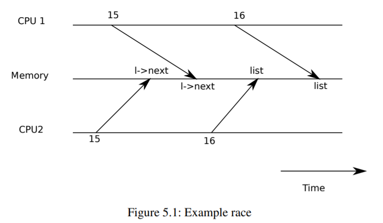

## Chapter 5 -- Locking

Most kernels, including xv6, interleave the execution of multiple activities. One source of interleaving is multiprocessor hardware: computers with multiple CPUs executing independently, such as xv6’s RISC-V. These multiple CPUs share physical RAM, and xv6 exploits the sharing to maintain data structures that all CPUs read and write. This sharing raises the possibility of one CPU reading a data structure while another CPU is mid-way through updating it, or even multiple CPUs updating the same data simultaneously; without careful design such parallel access is likely to yield incorrect results or a broken data structure. Even on a uniprocessor, the kernel may switch the CPU among a number of threads, causing their execution to be interleaved. Finally, a device interrupt handler that modifies the same data as some interruptible code could damage the data if the interrupt occurs at just the wrong time. The word `concurrency` refers to situations in which multiple instruction streams are interleaved, due to multiprocessor parallelism, thread switching, or interrupts.

Kernels are full of concurrently-accessed data. For example, two CPUs could simultaneously call `kalloc`  , thereby concurrently popping from the head of the free list. Kernel designers like to allow for lots of concurrency, since it can yield increased performance though parallelism, and increased responsiveness. However, as a result kernel designers spend a lot of effort convincing themselves of correctness despite such concurrency. There are many ways to arrive at correct code, some easier to reason about than others. Strategies aimed at orrectness under concurrency, and abstractions that support them, are called `concurrency  control` techniques. Xv6 uses a number of concurrency control techniques, depending on the situation; many more are possible. This chapter focuses on a widely used technique: thelock.

A lock provides mutual exclusion, ensuring that only one CPU at a time can hold the lock.

If the programmer associates a lock with each shared data item, and the code always holds the associated lock when using an item, then the item will be used by only one CPU at a time. In this situation, we say that the lock protects the data item.

The rest of this chapter explains why xv6 needs locks, how xv6 implements them, and how it uses them.



### 5.1 Race conditions

As an example of why we need locks, consider a linked list accessible from any CPU on a multiprocessor. The list supports push and pop operations, which may be called concurrently. Xv6’s memory allocator works in much this way;kalloc()(kernel/kalloc.c:69)pops a page of memory from a list of free pages, and kfree()(kernel/kalloc.c:47)pushes a page onto the free list.

If there were no concurrent requests, you might implement a list push operation as follows:

```c
1  struct element {
2    int data;
3    struct element *next;
4  };
5
6  struct element *list = 0;
7
8  void
9  push(int data)
10 {
11   struct element *l;
12
13   l = malloc(sizeof *l);
14   l->data = data;
15   l->next = list;
16   list = l;
17 }
```

This implementation is correct if executed in isolation. However, the code is not correct if more than one copy executes concurrently. If two CPUs executepushat the same time, both might execute line 15, before either executes line 16, (see Figure 5.1). There would then be two list elements withnextset to the former value oflist. When the two assignments tolisthappen at line 16, the second one will overwrite the first; the element involved in the first assignment will be lost.

The lost update at line 16 is an example of a `race condition`  . A race condition is a situation in which a memory location is accessed concurrently, and at least one access is a write. A race is often a sign of a bug, either a lost update (if the accesses are writes) or a read of an incompletely-updated data structure. The outcome of a race depends on the exact timing of the two CPUs involved and how their memory operations are ordered by the memory system, which can make race-induced errors difficult to reproduce and debug. For example, adding print statements while debugging pushmight change the timing of the execution enough to make the race disappear.

The usual way to avoid races is to use a lock. Locks ensure `mutual exclusion`  , so that only one CPU at a time can execute the sensitive lines ofpush; this makes the scenario above impossible.

The correctly locked version of the above code adds just a few lines (highlighted in yellow):

```c
6 struct element *list = 0;
7 struct lock listlock;
8
9 void
10 push(int data)
11 {
12   struct element *l;
13   l = malloc(sizeof *l);
14   l->data = data;
15
16   acquire(&listlock);
17   l->next = list;
18   list = l;
19   release(&listlock);
20 }
```

The sequence of instructions between `acquire` and `release`  is often called a `critical section` . The lock is typically said to be protectinglist.

When we say that a lock protects data, we really mean that the lock protects some collection of invariants that apply to the data. Invariants are properties of data structures that are maintained across operations. Typically, an operation’s correct behavior depends on the invariants being true when the operation begins. The operation may temporarily violate the invariants but must reestablish them before finishing. For example, in the linked list case, the invariant is thatlistpoints at the first element in the list and that each element’snextfield points at the next element. The implementation ofpushviolates this invariant temporarily: in line 17,lpoints to the next list element, butlistdoes not point atlyet (reestablished at line 18). The race condition we examined above happened because a second CPU executed code that depended on the list invariants while they were (temporarily) violated. Proper use of a lock ensures that only one CPU at a time can operate on the data structure in the critical section, so that no CPU will execute a data structure operation when the data structure’s invariants do not hold.

You can think of a lock as `serializing`  concurrent critical sections so that they run one at a time, and thus preserve invariants (assuming the critical sections are correct in isolation). You can also think of critical sections guarded by the same lock as being atomic with respect to each other, so that each sees only the complete set of changes from earlier critical sections, and never sees partially-completed updates. We say that multiple processes `conflict` if they want the same lock at the same time, or that the lock experiences `contention` .

Note that it would be correct to move `acquire` earlier inpush.For example, it is fine to move the call to `acquire` up to before line 13. This may reduce parallelism because then the calls to  `malloc`  are also serialized. The section “Using locks” below provides some guidelines for where to insert `acquire` and `release`  invocations.

### 5.2 Code: Locks

Xv6 has two types of locks: spinlocks and sleep-locks. We’ll start with spinlocks. Xv6 represents a spinlock as a `struct spinlock` (kernel/spinlock.h:2). The important field in the structure is locked, a word that is zero when the lock is available and non-zero when it is held. Logically, xv6 should  `acquire`  a lock by executing code like

```c
21 void
22 acquire(struct spinlock *lk) // does not work!
23 {
24   for(;;) {
25     if(lk->locked == 0) {
26       lk->locked = 1;
27       break;
28     }
29   }
30 }
```

Unfortunately, this implementation does not guarantee mutual exclusion on a multiprocessor. It could happen that two CPUs simultaneously reach line 25, see that `lk->locked` is zero, and then both grab the lock by executing line 26. At this point, two different CPUs hold the lock, which violates the mutual exclusion property. What we need is a way to make lines 25 and 26 execute as an `atomic` (i.e., indivisible) step.

Because locks are widely used, multi-core processors usually provide instructions that implement an atomic version of lines 25 and 26. On the RISC-V this instruction isamoswap r, a. amoswapreads the value at the memory addressa, writes the contents of registerrto that address, and puts the value it read intor. That is, it swaps the contents of the register and the memory address. It performs this sequence atomically, using special hardware to prevent any other CPU from using the memory address between the read and the write.

Xv6’s `acquire` (kernel/spinlock.c:22)uses the portable C library call__sync_lock_test_and_set, which boils down to theamoswapinstruction; the return value is the old (swapped) contents of `lk->locked`. The `acquire` function wraps the swap in a loop, retrying (spinning) until it has acquired the lock. Each iteration swaps one into `lk->locked` and checks the previous value; if the previous value is zero, then we’ve acquired the lock, and the swap will have set `lk->locked` to one. If the previous value is one, then some other CPU holds the lock, and the fact that we atomically swapped one into `lk->locked` didn’t change its value.

Once the lock is acquired, `acquire` records, for debugging, the CPU that acquired the lock.

The `lk->cpu` field is protected by the lock and must only be changed while holding the lock.

The function `release`  (kernel/spinlock.c:46)is the opposite of `acquire` : it clears the `lk->cpu` field and then releases the lock. Conceptually, the release just requires assigning zero to `lk->locked`.

The C standard allows compilers to implement an assignment with multiple store instructions, so a C assignment might be non-atomic with respect to concurrent code. Instead, `release`  uses the C library function__sync_lock_release that performs an atomic assignment. This function also boils down to a RISC-Vamoswapinstruction.

### 5.3 Code: Using locks

Xv6 uses locks in many places to avoid race conditions. To see a simple example much likepush above, look at `kalloc`  (kernel/kalloc.c:69)andfree(kernel/kalloc.c:34). Try Exercises 1 and 2 to see what happens if those functions omit the locks. You’ll likely find that it’s difficult to trigger incorrect behavior, suggesting that it’s hard to reliably test whether code is free from locking errors and races. It is not unlikely that xv6 has some races.

A hard part about using locks is deciding how many locks to use and which data and invariants each lock should protect. There are a few basic principles. First, any time a variable can be written by one CPU at the same time that another CPU can read or write it, a lock should be used to keep the two operations from overlapping. Second, remember that locks protect invariants: if an invariant involves multiple memory locations, typically all of them need to be protected by a single lock to ensure the invariant is maintained.

The rules above say when locks are necessary but say nothing about when locks are unnecessary, and it is important for efficiency not to lock too much, because locks reduce parallelism.

If parallelism isn’t important, then one could arrange to have only a single thread and not worry about locks. A simple kernel can do this on a multiprocessor by having a single lock that must be acquired on entering the kernel and released on exiting the kernel (though system calls such as pipe reads or `wait`  would pose a problem). Many uniprocessor operating systems have been converted to run on multiprocessors using this approach, sometimes called a “big kernel lock,” but the approach sacrifices parallelism: only one CPU can execute in the kernel at a time. If the kernel does any heavy computation, it would be more efficient to use a larger set of more fine-grained locks, so that the kernel could execute on multiple CPUs simultaneously.

As an example of coarse-grained locking, xv6’s `kalloc`  .callocator has a single free list protected by a single lock. If multiple processes on different CPUs try to allocate pages at the same time, each will have to wait for its turn by spinning in `acquire` . Spinning reduces performance, since it’s not useful work. If contention for the lock wasted a significant fraction of CPU time, perhaps performance could be improved by changing the allocator design to have multiple free lists, each with its own lock, to allow truly parallel allocation.
As an example of fine-grained locking, xv6 has a separate lock for each file, so that processes that manipulate different files can often proceed without waiting for each other’s locks. The file locking scheme could be made even more fine-grained if one wanted to allow processes to simultaneously write different areas of the same file. Ultimately lock granularity decisions need to be driven by performance measurements as well as complexity considerations.

As subsequent chapters explain each part of xv6, they will mention examples of xv6’s use of locks to deal with concurrency. As a preview, Figure 5.2 lists all of the locks in xv6.

Lock           | Description
---------------|-----------------------------------------
bcache.lock    | Protects allocation of block buffer cache entries
cons.lock      | Serializes access to console hardware, avoids intermixed output
ftable.lock    | Serializes allocation of a  `struct file`  in file table
icache.lock    | Protects allocation of inode cache entries
vdisk_lock     | Serializes access to disk hardware and queue of DMA descriptors
kmem.lock      | Serializes allocation of memory
log.lock       | Serializes operations on the transaction log pipe’s pi->lock Serializes operations on each pipe
pid_lock       | Serializes increments of next_pid proc’s `p->lock` Serializes changes to process’s state tickslock Serializes operations on the ticks counter
inode’s `ip->lock` | Serializes operations on each inode and its content
buf’s `b->lock`  | Serializes operations on each block buffer

> Figure 5.2: Locks in xv6


### 5.4 Deadlock and lock ordering

If a code path through the kernel must hold several locks at the same time, it is important that all code paths acquire those locks in the same order. If they don’t, there is a risk of `deadlock` . Let’s say two code paths in xv6 need locks A and B, but code path 1 acquires locks in the order A then B, and the other path acquires them in the order B then A. Suppose thread T1 executes code path 1 and acquires lock A, and thread T2 executes code path 2 and acquires lock B. Next T1 will try to acquire lock B, and T2 will try to acquire lock A. Both acquires will block indefinitely, because in both cases the other thread holds the needed lock, and won’t release it until its acquire returns. To avoid such deadlocks, all code paths must acquire locks in the same order. The need for a global lock acquisition order means that locks are effectively part of each function’s specification: callers must invoke functions in a way that causes locks to be acquired in the agreed-on order.

Xv6 has many lock-order chains of length two involving per-process locks (the lock in each  `struct proc` ) due to the way that `sleep`  works (see Chapter 6). For example,consoleintr (kernel/console.c:143)is the interrupt routine which handles typed characters. When a newline arrives, any process that is waiting for console input should be woken up. To do this,consoleintr holdscons.lockwhile calling `wakeup`  , which acquires the waiting process’s lock in order to wake it up. In consequence, the global deadlock-avoiding lock order includes the rule thatcons.lock must be acquired before any process lock. The file-system code contains xv6’s longest lock chains.

For example, creating a file requires simultaneously holding a lock on the directory, a lock on the new file’s inode, a lock on a disk block buffer, the disk driver’svdisk_lock, and the calling process’s `p->lock`  . To avoid deadlock, file-system code always acquires locks in the order mentioned in the previous sentence.

Honoring a global deadlock-avoiding order can be surprisingly difficult. Sometimes the lock order conflicts with logical program structure, e.g., perhaps code module M1 calls module M2, but the lock order requires that a lock in M2 be acquired before a lock in M1. Sometimes the identities of locks aren’t known in advance, perhaps because one lock must be held in order to discover the identity of the lock to be acquired next. This kind of situation arises in the file system as it looks up successive components in a path name, and in the code for `wait`  and `exit` as they search the table of processes looking for child processes. Finally, the danger of deadlock is often a constraint on how fine-grained one can make a locking scheme, since more locks often means more opportunity for deadlock. The need to avoid deadlock is often a major factor in kernel implementation.

### 5.5 Locks and interrupt handlers

Some xv6 spinlocks protect data that is used by both threads and interrupt handlers. For example, theclockintrtimer interrupt handler might increment `ticks`  (kernel/trap.c:163)at about the same time that a kernel thread reads `ticks`  in `sys_sleep` (kernel/sysproc.c:64). The lock `tickslock`   serializes the two accesses.

The interaction of spinlocks and interrupts raises a potential danger. Suppose `sys_sleep` holds tickslock, and its CPU is interrupted by a timer interrupt.clockintrwould try to acquire tickslock, see it was held, and wait for it to be released. In this situation, `tickslock`  will never be released: only `sys_sleep` can release it, but `sys_sleep` will not continue running until clockintrreturns. So the CPU will deadlock, and any code that needs either lock will also freeze.

To avoid this situation, if a spinlock is used by an interrupt handler, a CPU must never hold that lock with interrupts enabled. Xv6 is more conservative: when a CPU acquires any lock, xv6 always disables interrupts on that CPU. Interrupts may still occur on other CPUs, so an interrupt’s  `acquire` can wait for a thread to release a spinlock; just not on the same CPU.

xv6 re-enables interrupts when a CPU holds no spinlocks; it must do a little book-keeping to cope with nested critical sections. `acquire` calls `push_off`  (kernel/spinlock.c:87)and `release`   calls `pop_off`  (kernel/spinlock.c:98)to track the nesting level of locks on the current CPU. When that count reaches zero, `pop_off`  restores the interrupt enable state that existed at the start of the outermost critical section. Theintr_offandintr_onfunctions execute RISC-V instructions to disable and enable interrupts, respectively.

It is important that `acquire` call `push_off`  strictly before setting `lk->locked`(kernel/spinlock.c:28). If the two were reversed, there would be a brief window when the lock was held with interrupts enabled, and an unfortunately timed interrupt would deadlock the system. Similarly, it is important thatreleas `ecall`  `pop_off`  only after releasing the lock(kernel/spinlock.c:63).


### 5.6 Instruction and memory ordering

It is natural to think of programs executing in the order in which source code statements appear. Many compilers and CPUs, however, execute code out of order to achieve higher performance. If an instruction takes many cycles to complete, a CPU may issue the instruction early so that it can overlap with other instructions and avoid CPU stalls. For example, a CPU may notice that in a serial sequence of instructions A and B are not dependent on each other. The CPU may start instruction B first, either because its inputs are ready before A’s inputs, or in order to overlap execution of A and B. A compiler may perform a similar re-ordering by emitting instructions for one statement before the instructions for a statement that precedes it in the source.

Compilers and CPUs follow rules when they re-order to ensure that they don’t change the results of correctly-written serial code. However, the rules do allow re-ordering that changes the results of concurrent code, and can easily lead to incorrect behavior on multiprocessors [2, 3]. The CPU’s ordering rules are called the `memory model`  .

For example, in this code forpush, it would be a disaster if the compiler or CPU moved the store corresponding to line 4 to a point after the `release`  on line 6:

```c
1 l = malloc(sizeof *l);
2 l->data = data;
3 acquire(&listlock);
4 l->next = list;
5 list = l;
6 release(&listlock);
```

If such a re-ordering occurred, there would be a window during which another CPU could acquire the lock and observe the updatedlist, but see an uninitialized `list->next`.

To tell the hardware and compiler not to perform such re-orderings, xv6 uses__sync_synchronize() in both `acquire` (kernel/spinlock.c:22)and `release`  (kernel/spinlock.c:46).__sync_synchronize() is a `memory barrier`  : it tells the compiler and CPU to not reorder loads or stores across the barrier.

The barriers in xv6’s `acquire` and `release`  force order in almost all cases where it matters, since xv6 uses locks around accesses to shared data. Chapter 8 discusses a few exceptions.

### 5.7 Sleep locks

Sometimes xv6 needs to hold a lock for a long time. For example, the file system (Chapter 7) keeps a file locked while reading and writing its content on the disk, and these disk operations can take tens of milliseconds. Holding a spinlock that long would lead to waste if another process wanted to acquire it, since the acquiring process would waste CPU for a long time while spinning. Another drawback of spinlocks is that a process cannot yield the CPU while retaining a spinlock; we’d like to do this so that other processes can use the CPU while the process with the lock waits for the disk.

Yielding while holding a spinlock is illegal because it might lead to deadlock if a second thread then tried to  `acquire`  the spinlock; since `acquire` doesn’t yield the CPU, the second thread’s spinning might prevent the first thread from running and releasing the lock. Yielding while holding a lock would also violate the requirement that interrupts must be off while a spinlock is held. Thus we’d like a type of lock that yields the CPU while waiting to acquire, and allows yields (and interrupts) while the lock is held.

Xv6 provides such locks in the form of `sleep-locks`  . `acquire`  `sleep`  (kernel/sleeplock.c:22) yields the CPU while waiting, using techniques that will be explained in Chapter 6. At a high level, a sleep-lock has alockedfield that is protected by a spinlock, and `acquire` sleep’s call to `sleep`  atomically yields the CPU and releases the spinlock. The result is that other threads can execute while `acquire` sleep waits.

Because sleep-locks leave interrupts enabled, they cannot be used in interrupt handlers. Because `acquire`  `sleep`  may yield the CPU, sleep-locks cannot be used inside spinlock critical sections (though spinlocks can be used inside sleep-lock critical sections).

Spin-locks are best suited to short critical sections, since waiting for them wastes CPU time; sleep-locks work well for lengthy operations.

### 5.8 Real world

Programming with locks remains challenging despite years of research into concurrency primitives and parallelism. It is often best to conceal locks within higher-level constructs like synchronized queues, although xv6 does not do this. If you program with locks, it is wise to use a tool that attempts to identify race conditions, because it is easy to miss an invariant that requires a lock.

Most operating systems support POSIX threads (Pthreads), which allow a user process to have several threads running concurrently on different CPUs. Pthreads has support for user-level locks, barriers, etc. Supporting Pthreads requires support from the operating system. For example, it should be the case that if one pthread blocks in a system call, another pthread of the same process should be able to run on that CPU. As another example, if a pthread changes its process’s address space (e.g., maps or unmaps memory), the kernel must arrange that other CPUs that run threads of the same process update their hardware page tables to reflect the change in the address space.

It is possible to implement locks without atomic instructions, but it is expensive, and most operating systems use atomic instructions.

Locks can be expensive if many CPUs try to acquire the same lock at the same time. If one CPU has a lock cached in its local cache, and another CPU must acquire the lock, then the atomic instruction to update the cache line that holds the lock must move the line from the one CPU’s cache to the other CPU’s cache, and perhaps invalidate any other copies of the cache line. Fetching a cache line from another CPU’s cache can be orders of magnitude more expensive than fetching a line from a local cache.

To avoid the expenses associated with locks, many operating systems use lock-free data structures and algorithms. For example, it is possible to implement a linked list like the one in the beginning of the chapter that requires no locks during list searches, and one atomic instruction to insert an item in a list. Lock-free programming is more complicated, however, than programming locks; for example, one must worry about instruction and memory reordering. Programming with locks is already hard, so xv6 avoids the additional complexity of lock-free programming.


### 5.9 Exercises

1. Comment out the calls to `acquire` and `release`  in `kalloc`  (kernel/kalloc.c:69). This seems like it should cause problems for kernel code that calls `kalloc`  ; what symptoms do you expect to see? When you run xv6, do you see these symptoms? How about when running usertests? If you don’t see a problem, why not? See if you can provoke a problem by inserting dummy loops into the critical section of `kalloc`  .
2. Suppose that you instead commented out the locking in  `kfree`  (after restoring locking in `kalloc`  ). What might now go wrong? Is lack of locks inkfreeless harmful than in  `kalloc`  ?
3. If two CPUs call `kalloc`  at the same time, one will have to wait for the other, which is bad for performance. Modify `kalloc`  .cto have more parallelism, so that simultaneous calls to  `kalloc`  from different CPUs can proceed without waiting for each other.
4. Write a parallel program using POSIX threads, which is supported on most operating systems. For example, implement a parallel hash table and measure if the number of puts/gets scales with increasing number of cores.
5. Implement a subset of Pthreads in xv6. That is, implement a user-level thread library so that a user process can have more than 1 thread and arrange that these threads can run in parallel on different CPUs. Come up with a design that correctly handles a thread making a blocking system call and changing its shared address space.

